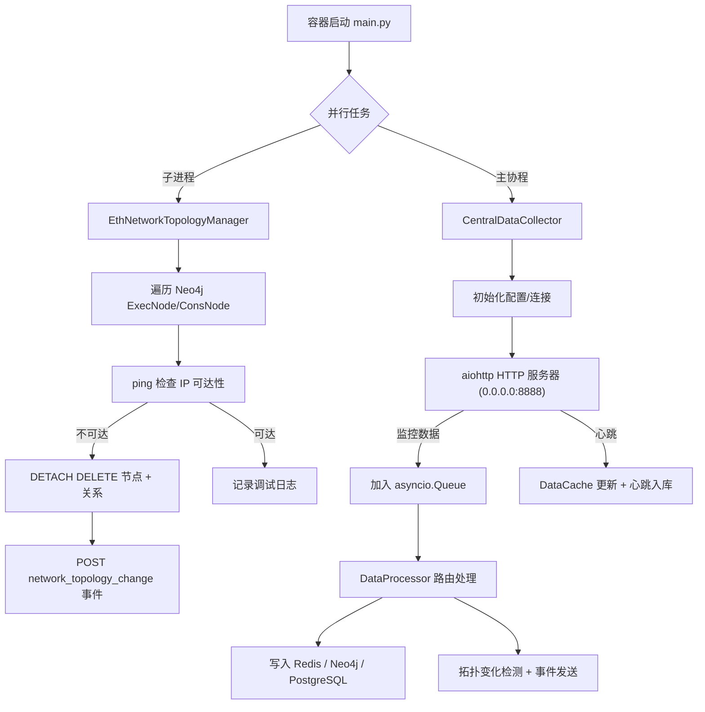

# eth_node_cleaner 网络拓扑管理与中央采集容器

> `eth_node_cleaner` 容器集成了网络层连通性守护与中央数据采集两大能力，确保 Neo4j 图数据库仅包含真实可通信的节点，同时为 Ethereum 平台提供统一的监控数据入口、拓扑变化事件与信标链分叉检测。全部脚本兼容 Python 3.12.12，可在受限网络环境下离线部署。

## 目录

- [eth\_node\_cleaner 网络拓扑管理与中央采集容器](#eth_node_cleaner-网络拓扑管理与中央采集容器)
  - [目录](#目录)
  - [概述](#概述)
  - [整体架构](#整体架构)
  - [目录结构](#目录结构)
  - [核心组件](#核心组件)
    - [网络拓扑真实性管理器（eth\_node\_cleaner.py）](#网络拓扑真实性管理器eth_node_cleanerpy)
    - [容器启动入口（main.py）](#容器启动入口mainpy)
    - [中央数据采集子系统（central\_collector）](#中央数据采集子系统central_collector)
  - [数据流与事件链路](#数据流与事件链路)
    - [1. 监控数据采集到入库](#1-监控数据采集到入库)
    - [2. 拓扑变化检测与广播](#2-拓扑变化检测与广播)
    - [3. 网络层真实性维护](#3-网络层真实性维护)
  - [配置与环境变量](#配置与环境变量)
  - [HTTP API](#http-api)
  - [部署与运维](#部署与运维)
  - [运行维护与监控](#运行维护与监控)
  - [与 eth\_node\_monitoring 代理的协作](#与-eth_node_monitoring-代理的协作)
  - [故障排查](#故障排查)
  - [版本与变更记录](#版本与变更记录)
  - [参考资料](#参考资料)

## 概述

- **目标**  
  1. 保证 Neo4j 中的执行层/共识层节点仅代表网络层真实可达的容器。  
  2. 暴露统一的 HTTP 接口，将来自监控代理和系统组件的链上、链下数据异步落盘到 Redis / Neo4j / PostgreSQL，并触发拓扑变化事件。

- **运行环境要求**
  - Python ≥ 3.12.12
  - 建议配置 Neo4j、Redis、PostgreSQL，以启用全量功能（缺失时自动降级为内存缓存或跳过持久化）。
  - 容器需连接至与以太坊节点相同的 Docker 网络。

## 整体架构



> 网络层与应用层的变化检测分别由 `EthNetworkTopologyManager` 与 `TopologyChangeDetector` 负责，两者互补构成完整的拓扑真实性链路。

## 目录结构

```
eth_node_cleaner/
├── Dockerfile
├── main.py                      # 容器启动入口
├── eth_node_cleaner.py          # 网络拓扑真实性管理器
├── README.md                    # 统一说明文档（当前文件）
├── wheels/                      # 离线依赖（可选）
└── central_collector/           # 中央数据采集子系统
    ├── __init__.py
    ├── collector.py
    ├── config.py
    ├── http_server.py
    ├── data_processor.py
    ├── blockchain_processor.py
    ├── topology_change_detector.py
    ├── change_event_sender.py
    └── state_manager.py
```

## 核心组件

### 网络拓扑真实性管理器（eth_node_cleaner.py）

- **类：`EthNetworkTopologyManager`**
  - 通过环境变量读取 Neo4j 连接信息，带重试机制 `_get_neo4j_driver_with_retry()` 成功建立驱动。
  - `get_all_recorded_nodes()` 查询 Neo4j 中 `ExecNode` 与 `ConsNode` 的 `node_id`、`ip`。
  - `ping_check(ip)` 对节点 IP 执行快速 `ping -c 2 -W 3`，判定网络层可达性。
  - `cleanup_unreachable_nodes()` 遍历节点列表，调用 `_delete_node_from_neo4j()` 清理不可达节点，同步更新统计信息。
  - 删除节点后通过 `_send_node_deletion_event()` 构造 `network_topology_change` 事件并 POST 至中央采集器 `/api/v1/monitoring/data`。
  - `run_topology_management()` 每 6 秒轮询一次，兼顾攻击场景下的快速响应，并定期输出累计检查/删除数量。

> 该管理器只处理网络层(IP 连通性)；应用层 P2P 连接变化由中央采集器负责检测。

### 容器启动入口（main.py）

- 使用 `ProcessPoolExecutor` 将 `EthNetworkTopologyManager` 运行在子进程，避免阻塞主事件循环。
- 主协程中初始化 `CentralDataCollector`，阻塞运行直到收到退出信号。
- 注册 SIGINT / SIGTERM，如果用户在宿主机按下 Ctrl+C，会触发 `signal_handler()` 并使两个子系统有序退出。

### 中央数据采集子系统（central_collector）

| 组件 | 功能要点 |
| --- | --- |
| `collector.py` | `CentralDataCollector` 负责生命周期管理：加载配置、初始化数据库连接、启动 aiohttp 服务、创建数据处理/心跳后台任务、输出健康状态。 |
| `config.py` | `CollectorConfig.from_env()` 统一解析环境变量。兼容 `NEO4J_USERNAME` / `NEO4J_USER` 等旧键名，确保与 Foundation 层配置一致。 |
| `http_server.py` | 构建 aiohttp 应用，路由包括 `/api/v1/monitoring/data`、`/heartbeat`、多个查询接口以及 `/health`。将请求封装为 `CollectedData` 并写入异步队列。 |
| `data_processor.py` | 异步数据路由核心。按 `data_type` 调度到 `_process_p2p_topology`、`_process_beacon_blocks`、`_process_metrics` 等 handler，并在需要时调用 `TopologyChangeDetector`、`BlockchainProcessor`、`ChangeEventSender`。 |
| `blockchain_processor.py` | 追踪信标链区块与分叉。维护 slot→blocks 缓存、计算生产延迟、记录传播轨迹、生成并发布 `ForkEvent`。 |
| `topology_change_detector.py` | 基于 Redis 缓存记录执行层/共识层节点及验证者状态，检测节点新增/属性变化、对等连接增删、验证者变动，输出标准化变化事件。 |
| `change_event_sender.py` | 将变化事件写入 PostgreSQL 的 `eth_execution_topology_changes` / `eth_consensus_topology_changes` 等表，同时写入 Redis Stream 并发布到 `topology:changes:*` 频道，支持下游订阅。 |
| `state_manager.py` | 管理 Redis 状态缓存与索引：维护活跃节点集合、验证者索引、统计信息，同时提供过期清理与回退查询。 |
| `models.py` | 定义 `CollectedData` 与 `DataCache` 数据结构。 |

> 所有持久化操作均为真实代码路径：Redis 使用 `redis.asyncio`，Neo4j 使用 `neo4j.AsyncGraphDatabase`，PostgreSQL 使用 `asyncpg` 连接池。

## 数据流与事件链路

### 1. 监控数据采集到入库

1. 监控代理或系统组件向 `/api/v1/monitoring/data` 发送 JSON。`HTTPServer._handle_monitoring_data()` 解析 `timestamp`（支持 Unix 与 ISO8601），转换为 `CollectedData`。
2. 数据入队后由后台任务 `_data_processing_loop()` 消费，调用 `DataProcessor.process_data()`。
3. 依据 `data_type` 执行不同 handler：
   - **拓扑类**：`_process_p2p_topology()` / `_process_execution_links()` 在 Neo4j 中更新执行层、共识层节点与连接关系，随后调用 `_detect_topology_changes()`。
   - **信标链类**：`_process_beacon_blocks()`、`_process_beacon_state()`、`_process_attestations()` 将区块、状态、认证写入 PostgreSQL 与 Redis，触发 `BlockchainProcessor` 分叉检测。
   - **链上交易类**：`_process_transactions()`、`_process_contracts()` 写入 PostgreSQL `transactions`/`contracts` 等表，并在 Neo4j 中构建交易/合约图。
   - **性能指标**：`_process_metrics()` 将 CPU/内存/网络指标存入 Redis Sorted Set。
   - **节点快照**：`_process_node_snapshots()` 写入 PostgreSQL `node_snapshots`。
   - **网络层变化事件**：`_process_network_topology_change()` 接收来自拓扑管理器的 `node_unreachable` 事件，将其标准化并写入变化记录。
   - **心跳数据**：`HTTPServer._handle_heartbeat()` 使用 `DataCache.container_data` 缓存最近一次心跳，并调用 `DataProcessor.process_heartbeat()` 将 `agent_type`、`monitoring_capabilities` 等字段写入 PostgreSQL `agent_heartbeats` 表（当连接可用时），供 Foundation 层实时感知代理状态。

### 2. 拓扑变化检测与广播

1. `TopologyChangeDetector` 读取 Redis 中的历史状态（若无则回退到 Postgres），与最新拓扑数据对比，识别节点新增、属性变化、连接增删、验证者状态变化。
2. `ChangeEventSender.send_topology_changes()` 按层级（execution/consensus）分类，将事件写入 `eth_execution_topology_changes` / `eth_consensus_topology_changes` 等表，并更新子表（节点变化、连接变化、验证者变化）。
3. 事件同时写入 Redis Stream `topology:changes`，并发布至 `topology:changes:execution` / `topology:changes:consensus` 频道；`send_heartbeat_event()` 每次检测后更新状态键 `topology:detector:heartbeat`。

### 3. 网络层真实性维护

- `EthNetworkTopologyManager` 清理不可达节点后，构造 `data_type="network_topology_change"` 的载荷（包含 `layer`、`node_id`、`reason`、`impact_score`）发送给中央采集器，实现网络层与应用层事件的统一记录。

- `DataProcessor._process_fork_event()` 将分叉事件写入 PostgreSQL `fork_events` 表，并通过 Redis 频道 `fork_alerts` 发布实时告警；`BlockchainProcessor` 在收到新块时维护 block→slot 缓存、记录传播路径与提议者统计，以便上层服务快速呈现异常。

## 配置与环境变量

| 变量 | 默认值 | 说明 |
| --- | --- | --- |
| `COLLECTOR_HOST` | `0.0.0.0` | HTTP 服务器监听地址 |
| `COLLECTOR_PORT` | `8888` | HTTP 服务器端口 |
| `LOG_LEVEL` | `INFO` | 中央采集器日志级别 |
| `NEO4J_URI` | `bolt://eth_neo4j:7687` | Neo4j 连接地址（拓扑管理器与采集器共用） |
| `NEO4J_USERNAME` (`NEO4J_USER`, `neo4j_user`) | `neo4j` | Neo4j 用户名，兼容旧变量 |
| `NEO4J_PASSWORD` (`neo4j_password`) | `1qaz@WSX` | Neo4j 密码 |
| `REDIS_HOST` / `REDIS_PORT` / `REDIS_PASSWORD` | — | Redis 连接信息；缺失时相关功能降级为内存缓存 |
| `POSTGRESQL_DSN` (`POSTGRES_DSN`) | — | PostgreSQL 连接串；缺失时跳过写库 |
| `COLLECTOR_MAX_BEACON_BLOCKS` (`MAX_BEACON_BLOCKS`) | `100` | 信标链区块缓存上限 |
| `COLLECTOR_CACHE_TTL` (`CACHE_TTL`) | `300` | DataCache 默认过期时间（秒） |
| `CENTRAL_COLLECTOR_URL` / `HEARTBEAT_URL` | — | 供代理脚本配置的上报地址（通常指向本容器） |

## HTTP API

| 方法 | 路径 | 功能 | 请求体主要字段 | 响应 |
| --- | --- | --- | --- | --- |
| `POST` | `/api/v1/monitoring/data` | 推送监控数据 | `container_id`, `node_id`, `timestamp`, `data_type`, `data`, `agent_version`, `local_ip` | `{"status": "success"}` |
| `POST` | `/api/v1/monitoring/heartbeat` | 上报代理心跳 | `container_id`, `node_id`, `status`, `agent_type`, `monitoring_capabilities` | `{"status": "success", "timestamp": ...}` |
| `GET` | `/api/v1/monitoring/status` | 查询收集器运行状态 | — | 队列长度、活跃容器数、缓存统计 |
| `GET` | `/api/v1/monitoring/beacon/blocks` | 获取信标链区块 | `limit`（可选） | 缓存中的区块列表、时间戳 |
| `GET` | `/api/v1/monitoring/beacon/fork_events` | 获取分叉事件摘要 | — | 活跃分叉与已解决分叉 |
| `GET` | `/api/v1/monitoring/beacon/network_health` | 获取网络健康状态 | — | 当前健康级别、活跃容器数 |
| `GET` | `/api/v1/monitoring/beacon/attack_indicators` | 获取攻击指标 | — | 最近检测到的指标 |
| `GET` | `/health` | 健康检查 | — | `{"status": "healthy", ...}` |

所有接口均返回 JSON，错误时含 `error` 字段。`timestamp` 字段既支持 Unix 时间戳也支持 ISO 8601 字符串。

## 部署与运维

1. **构建容器**
   ```bash
   docker-compose build eth_node_cleaner
   ```
2. **启动服务**
   ```bash
   docker-compose up -d eth_node_cleaner
   ```
3. **实时日志**
   ```bash
   docker-compose logs -f eth_node_cleaner
   ```
4. **健康检查**
   ```bash
   curl http://localhost:8888/health
   curl http://localhost:8888/api/v1/monitoring/status
   ```
5. **网络真实性验证**
   - 在任意节点容器执行 `ip link set eth0 down`，确认 Neo4j 中对应节点被删除，并在中央采集器日志中看到 `network_topology_change`。
   - 恢复网络后检查节点重新上报，确保拓扑数据回归正常。

## 运行维护与监控

- **日志输出**：默认使用 `LOG_LEVEL` 指定级别，可在容器日志中查看拓扑清理统计、数据处理状态、数据库连接情况。
- **心跳检测**：后台任务 `_heartbeat_checker()` 每 30 秒检查一次 DataCache，超过 60 秒未更新的容器会被标记为 `inactive` 并在日志中告警。
- **状态缓存**：`StateManager` 在 Redis 中维护 `topology:execution_state:*`、`topology:consensus_state:*` 等键，可用于快速定位节点状态。
- **资源释放**：`CentralDataCollector.stop()` 关闭 HTTP 服务器、数据库连接并取消所有后台任务；`EthNetworkTopologyManager.__del__()` 负责关闭 Neo4j 驱动。

## 与 eth_node_monitoring 代理的协作

- `neighbor_monitor.py`、`beacon_monitor.py`、`performance_monitor.py` 等代理默认将 `CENTRAL_COLLECTOR_URL` 设置为本容器的 `/api/v1/monitoring/data`，`HEARTBEAT_URL` 指向 `/api/v1/monitoring/heartbeat`。
- 代理上报的 `p2p_topology`、`beacon_blocks`、`metrics` 数据由 `DataProcessor` 处理，并与网络层 `network_topology_change` 事件在统一的拓扑变化系统中合并，便于 Foundation 层进行全局告警。
- 通过 Redis 和 PostgreSQL 中的状态/事件记录，可以将容器级异常（离线、拓扑变化）与链上事件（分叉、验证者状态变化）关联分析。

## 故障排查

- **HTTP 200 但无数据入库**：检查 `data_processor.py` 日志是否报错，确认 `data_type` 已在处理表中注册；缺失的数据库依赖会以 WARNING 提示。
- **Neo4j 未写入或清理失败**：确认 `NEO4J_URI`、认证信息、Docker 网络连接正常；必要时在容器内执行 `cypher-shell` 验证。
- **Redis 操作异常**：确保 Redis 服务可达，且账户拥有 Streams、Sorted Set、Hash 权限。`redis.asyncio` 初始化失败时会在日志中出现 WARNING。
- **PostgreSQL 约束错误**：核对 Foundation 层数据库的表结构（如 `validators`、`agent_heartbeats`、`eth_execution_topology_changes` 等）是否按最新迁移部署。
- **拓扑管理器持续重试**：可能是 Neo4j 未启动或网络受限。日志会显示重试次数和异常详情；若 `ping` 命令缺失，请安装 `iputils-ping`。

## 版本与变更记录

- 中央采集器版本：`central_collector.__version__ = 4.2.0`
- 配置模块：v4.3.0（统一环境变量命名与兼容策略）
- 网络拓扑管理器：Enhanced 版本，支持检测 `ip link set eth0 down/up` 等攻击场景
- 主要增强亮点：
  - 将 `EthNetworkTopologyManager` 清理事件纳入中央采集器，形成网络层+应用层的统一变化流。
  - `TopologyChangeDetector`、`ChangeEventSender` 实现 P2P 拓扑变化事件标准化与落库。
  - `BlockchainProcessor` 处理信标链区块、分叉及传播延迟，发布实时告警。

## 参考资料

- [Python 3.12.12 官方文档](https://docs.python.org/3.12/)
- [aiohttp 官方文档](https://docs.aiohttp.org/)
- [Neo4j Python Driver 指南](https://neo4j.com/docs/python-manual/)
- [redis-py asyncio 文档](https://redis.readthedocs.io/en/stable/)
- [asyncpg 文档](https://magicstack.github.io/asyncpg/current/)

