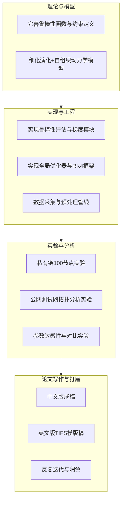

# 基于网络演化动力学的区块链拓扑优化 TIFS 论文整体计划

## 1. 目标与成果形式

- **核心目标**：围绕`docs/参考文档.md`中提出的演化+自组织拓扑优化方法，在真实/仿真区块链网络上完成系统实验验证，形成**一篇方法+实验充分的IEEE TIFS级论文**。
- **成果形式**：
  - **中文版论文**：用于团队内部评审与中文材料积累（结构与TIFS英文稿严格对齐）。
  - **英文版TIFS投稿稿**：完全符合IEEE TIFS论文结构、格式与学术规范（含LaTeX模版、图表、附录与补充材料）。

## 2. 现有基础与资源梳理

- **理论与方法基础**：
  - 已有较完整的方法论描述：鲁棒性函数R、演化动力学、自组织动力学、RK4数值积分、约束处理等，详见 `[docs/参考文档.md](docs/参考文档.md)`。
  - 代码接口约定：`models/robustness.py`、`models/global_optimizer.py`（计划中已有引用，后续需严格对齐实现）。
- **实验平台与数据来源**：
  - **可控私有链 / 联盟链环境**：
    - 以太坊 100 节点虚拟化容器网络（真实以太坊客户端 + 软路由虚拟广域网），部署在云服务器 `161.97.133.14:22` 上（登录账号与密码信息后续补充），用于承载私有链攻击/性能实验与拓扑采集。
    - 波卡（Polkadot） 100 节点虚拟化容器网络（真实 Polkadot/Substrate 节点软件 + 软路由虚拟广域网），与以太坊环境在同一物理/虚拟资源上或等价环境中部署，用于结构与鲁棒性指标实验。
  - **现有代码仓库**（将在 `全局拓扑优化/` 计划基础上集成与对齐）：
    - 波卡相关环境与工具代码：`https://github.com/ht1220/polkadot_Virtual_Network.git`
    - 以太坊 100 节点虚拟网络相关环境与工具代码：`https://github.com/ht1220/ethereum_Virtual_Network.git`
    - 爬虫相关代码：[https://github.com/ht1220/sepolia_crawlers_discv4-5.git](https://github.com/ht1220/sepolia_crawlers_discv4-5.git)
  - **公网测试网数据**：
    - 以太坊共识客户端与执行客户端 P2P 爬虫，可爬取 `Sepolia`（用户称 "special"）测试网的节点拓扑快照及演化数据。

## 3. 总体技术路线与模块划分

## 4. 数据需求分析（结合实验方法与IEEE TIFS要求）

### 4.1 统一数据抽象与核心对象

- **节点级信息**（抽象统一，但在不同环境中用途不同）：
  - 节点ID（如`enode`/`peer_id`/`node_index`）、角色（验证者/全节点/轻节点等）。
  - 客户端类型/版本：
    - 在以太坊/波卡 100 节点私有链中，客户端类型与版本在实验期间基本固定，主要用于**实验环境与控制变量的描述**（保证可复现性），不作为动力学建模的输入特征。
    - 在Sepolia测试网中，客户端类型/版本具有多样性，可作为**拓扑位置、度分布与安全风险的辅助分析特征**（例如不同客户端在网络中的中心性与易受攻击性）。
  - 节点运行状态与在线时长：用于过滤短暂/不稳定节点，保持分析集中在“长期在线、结构上有代表性”的节点集合上。
- **边/连接级信息**：
  - 邻接关系：当前时刻邻居列表，形成邻接矩阵`A(t)`或边列表`E(t)`，是所有鲁棒性指标与动力学模型的基础输入。
  - 连接方向与类型（入站/出站）、端口/协议（TCP/QUIC）、是否跨AS/跨地理区域：
    - 在核心方法中仅需“是否存在连接”（二值或权重边）；
    - 这些额外维度主要用于**扩展分析**，例如跨地域/跨AS边的比例、不同运营商域之间的桥接情况，用于从去中心化、安全与路由多样性的角度补充讨论。
  - 链路质量（若实验可采集）：延迟RTT、带宽估计、失败率。
    - 主体方法在结构层面将所有存在的边视为单位权重，用于计算路径长度与连通性；
    - 链路质量数据可用于**事后校准与解释**：分析优化前后高度节点是否更多落在低延迟/高带宽链路上，从而说明“结构优化并未牺牲、甚至改善性能”。
- **时序拓扑数据**：
  - 多个时间快照 `{A(t_k)}`，用于：
    - 动力学参数的最大似然估计（3.6节），即通过连续拓扑观测反推演化与自组织方程中的参数；
    - 真实拓扑演化特征对比（BA/WS等基础模型与本文模型的拟合度），检验本文模型对公网与私有链演化规律的解释能力。

### 4.2 针对鲁棒性指标R的具体数据需求

- **静态鲁棒性Rs相关数据**（骨架稳固性）：
  - 计算拉普拉斯矩阵 `L = D - A` 所需的 **邻接矩阵A** 与 **度向量k**：
    - 数据需求：任一时刻的全图连接关系（在100节点规模下易于获取），即可得到`L`与节点度。
  - 度分布统计：
    - 每个节点度`k_i`，可直接由拓扑得出，用于构造度分布的变异系数或幂律指数，刻画“hub 集中程度”与无标度健康态。
  - 聚类系数：
    - 局部三角形计数、闭三角与开三角数量，或借助NetworkX等库按拓扑快照计算（不额外增加采集需求），用于刻画局部冗余与三角闭合结构。
- **连接鲁棒性Rc（逆距离）相关数据**（传播效率）：
  - 全图或采样节点对的最短路径：
    - 只需**无权拓扑**（存在边视为1），无需精确带宽或延迟权重；
    - 采集需求即为**连通图结构**本身，不额外要求性能测量。
  - 该项用于度量在结构层面上“平均路径长度”和“全局效率”，在实验中将与真实广播延迟和消息开销建立经验相关性，用以验证其作为性能代理的合理性。
- **恢复鲁棒性Rr（τ代理）相关数据**（恢复能力）：
  - 仍基于节点加权度`k_i`即可，通过拓扑推导，无需额外观测：
    - 由`k_i`构造恢复时间代理`τ_i = 1/(1 + k_i)`及其归一化指数函数，汇总为全网的恢复鲁棒性评分`R_r`。
  - 若需要验证“度与恢复速度的关联假设”，可在私有链上补充少量可控实验数据：
    - 在模拟故障或攻击场景中，记录网络从部分断连状态恢复到高连通/低路径长度状态所需时间，
    - 将观测到的恢复时间与`k_i`和`R_r`之间做相关性分析，以增强这一代理指标的物理与安全解释力。

### 4.3 动力学模型与参数估计的数据需求

- **用于MLE的拓扑时序数据**：
  - 在私有链（以太坊/波卡）中：
    - 考虑到私有链P2P层运行较为平稳、节点与客户端版本基本固定，采用“长时间运行 + 稀疏采样 + 窗口切片”的策略。
    - 系统连续运行数天，在时间轴上**每5~10分钟**采集一次全网拓扑快照 `A(t_k)`，得到一条较长的拓扑时间序列。
    - 离线分析阶段，从该长序列中截取若干个时间窗口，每个窗口构成一组时序片段 A(t_k)，用于参数估计与验证。
  - 在Sepolia测试网：
    - 由于公网测试网拓扑变化更频繁，可采用**每1~2分钟一次**的周期性采样，或在发现事件（如节点大规模上线/下线）附近提高采样频率。
    - 同样对长时间序列做窗口切片，以构造多组时序片段。
  - 每条记录应包括：时间戳`t_k`、节点集合`V`（或其变化）、边集合`E(t_k)`。
  - 规模要求：
    - 每种环境（以太坊私有链、波卡私有链、Sepolia测试网）至少获得**3~5组**时序片段用于参数拟合，必要时再留出**2~3组**用于独立验证。
    - 每组时序片段包含`20~40`个连续时间点，在给定采样间隔下既能覆盖足够长的真实时间，又能保证相邻快照之间存在可观测的拓扑变化（边变化率在数个百分点到数十个百分点之间）。
- **私有链可控实验中用于验证动力学的额外数据**：
  - 在控制条件（固定节点上线/下线策略、P2P配置不变）下，对相同业务负载记录长时间拓扑演化，并从中选取代表性窗口，用于验证模型对“演化趋势”的拟合能力（吸引子形态、度分布、聚类等宏观统计量）。

### 4.4 IEEE TIFS层面需要的补充数据（可选但建议）

- **安全与攻击相关数据**（增强安全性贡献）：
  - 在100节点私有链上，设计有限但具有代表性的攻击/失效场景：
    - 随机删除节点/边（例如删除5%、10%、15%的节点或边）；
    - 目标攻击（删除若干最高度节点，如前3个或前5个高度节点）；
    - 模拟链下网络抖动导致连接重建（短时间内扰动少量链路或节点，再观察恢复过程）。
  - 每类攻击场景在同一拓扑形态下独立重复若干次（建议每类场景重复 3~~5 次，条件允许时可扩展到 5~~10 次），以便获得均值与方差。
  - 需要记录：
    - 攻击前后及恢复过程中的LCC占比、平均最短路径长度、图直径等结构指标随时间的变化曲线；
    - 在有限攻击场景下的区块/交易传播性能（延迟分布、成功率）随时间的变化。
  - 数据用途：
    - 比较**基线拓扑与优化后拓扑**在相同攻击强度下的最小LCC占比、路径长度恶化幅度及恢复时间，定量说明“优化后的拓扑在安全鲁棒性上的提升”。
- **性能影响数据**（佐证“优化不牺牲性能”）：
  - 在私有链中，对**基线拓扑**与**优化后拓扑**分别进行多轮独立运行：
    - **“每种拓扑形态至少进行 3–5 轮实验”**（3 到 5 轮），
    - **“每轮连续运行 30–60 分钟”**（30 到 60 分钟）
    - 在每轮实验中持续记录区块和交易的传播延迟，以及P2P消息数量和系统资源利用率。
  - 具体测量指标包括：
    - 区块和交易的广播延迟分布（p50/p90/p99等）；
    - 每区块/每事务的P2P消息开销变化（消息数或字节数的统计）；
    - CPU/带宽利用率的时间序列（例如每5~10秒采样一次）。
  - 数据处理方式：
    - 先对单轮运行计算上述指标的汇总统计量，再在3~5轮运行之间计算均值与标准差；
    - 在图表中对比基线与优化后拓扑的性能指标差异，展示优化在显著提升鲁棒性的同时，对正常性能的影响处于可接受甚至略有改善的范围。
  - 数据用途：构建TIFS式“安全-性能折中”分析章节，支撑结论“所提出的拓扑优化方法在提升抗毁能力的同时没有引入不可接受的性能退化”。

## 5. 实验设计与数据采集计划

### 5.0 实验实施流程与数据分层

为兼顾代码调试效率与 TIFS 级实验严谨性，实验过程分为两个阶段的数据分层使用策略：

- **阶段 A：轻量级数据集（Algorithm Sanity Check Dataset）**  
  - 目的：快速验证算法与代码实现是否正确、数值是否稳定、参数范围是否合理，**不直接用于给出论文主结论**。  
  - 数据构造方式：  
    - 从以太坊/波卡 100 节点私有链与 Sepolia 数据中抽取小规模子图与短时间窗口，例如：  
      - 20~50 节点子图（从 100 节点中按度或随机抽样获得最大连通子图）；  
      - 时间窗口长度 5~~10 个连续快照（而非 20~~40 个），攻击/性能场景可只选 1~2 个强度、较少重复次数。
  - 主要用途：  
    - 调试 `robustness.py` 与 `global_optimizer.py` 的实现；  
    - 检查 R 提升趋势、演化轨迹收敛性、参数扰动下结果是否符合直觉；  
    - 形成一份简要的算法验证文档（记录使用的轻量数据集、参数与现象），存放于 `全局拓扑优化/docs/`，供后续调试与附录引用。
- **阶段 B：全量数据集（Full Experimental Dataset）**  
  - 目的：在**完整 100 节点、完整采样与攻击/性能配置**下，得到可以写入 TIFS 正文的定量结论。  
  - 数据构造方式：  
    - 使用完整 100 节点拓扑（私有链）与 4.3 节中约定的时序采集策略（私有链运行 24~~72 小时、每 5~~10 分钟；Sepolia 每 1~~2 分钟），构造 3~~5 组 20~40 点的时序片段；  
    - 按 5.1～5.3 中的攻击、性能、参数实验配置完整执行（攻击强度、重复次数、对比方法等）。
  - 主要用途：  
    - 所有图表与表格（尤其是鲁棒性提升、攻击下表现、安全–性能折中、参数敏感性与对比结果）原则上基于全量数据集生成；  
    - 轻量数据集结果只作为实现正确性的 sanity check 或附录中的补充，不作为主结果的依据。

后续 5.1～5.3 的实验设计均默认基于阶段 B 的全量数据集实施；阶段 A 的轻量数据集主要服务于 6.1 节所述代码实现与调参与内部验证。

### 5.1 私有链100节点拓扑实验

- **以太坊100节点私有链**：
  - 任务：
    - 部署并校验基线拓扑（常见的Geth/Nethermind等客户端），确认P2P层稳定工作。
    - 运行业务负载（区块出块、交易发送）并记录：
      - 拓扑快照`A_0`以及时序`{A(t_k)}`。
      - 性能指标（传播延迟、消息数量）。
    - 运行演化+自组织优化算法生成`A`*及边操作列表（`edges_to_add`、`edges_to_remove`）；在私有链中按**5.1.1 实际重连实施流程**执行边的添加与删除。
    - 在优化后拓扑下重复相同负载，记录新的性能与鲁棒性指标，用于对比。
- **5.1.1 私有链中的实际重连实施流程**（以太坊与波卡通用思路）：
  - **（1）优化输出解析**：从优化器输出得到 `A`* 与当前拓扑 `A_0` 的差异，生成 `edges_to_add`、`edges_to_remove`（边以节点索引对 `(i,j)` 表示）。
  - **（2）节点ID映射**：建立图节点索引到链上节点标识的映射表。以太坊使用 `enode`（可从各节点 `admin_nodeInfo` 或部署配置获取），波卡使用 `peer_id`（可从 `system_localPeerId`、`system_peers` 或配置获取）。
  - **（3）按节点执行重连**：
    - **以太坊（Geth）**：对每个节点调用 `admin_peers` 获取当前邻居；对 `edges_to_remove` 中涉及的边调用 `admin_removePeer(enode)` 断开；对 `edges_to_add` 中涉及的边，由约定的一端（如度数较小或索引较小）调用 `admin_addPeer(enode)` 建立连接。
    - **波卡/Substrate**：根据所用版本的 peer 管理接口（RPC 或 `reserved_peers`/`bootnodes` 配置），更新各节点的允许/保留 peer 列表，使目标连接集合与优化结果一致；必要时重启节点或等待 P2P 层按新配置重连。
  - **（4）执行节奏**：采用分批、间隔执行（如每批修改若干边、间隔数秒），避免瞬时大规模断连影响共识稳定性。
  - **（5）拓扑校验**：重连完成后，重新采集全网拓扑（对各节点调用 `admin_peers` 或等价接口），构造实际邻接矩阵 `A_actual`，与 `A`* 对比（边一致率、度分布等）；若偏差可接受，则视为「优化后拓扑」实验基线已建立。
- **波卡100节点私有链**：
  - 任务：
    - 构建类似的拓扑快照与时序数据，以验证方法在不同协议栈下的可迁移性。
  - **以太坊与波卡实验的分工**（在资源约束下可形成互补；若资源充足可两类链均做全量实验）：
    - **以太坊实验侧重「性能与攻击场景」**
      - **依托条件**：100 节点容器网络 + 真实以太坊客户端（Geth/Nethermind 等）+ 软路由虚拟广域网；各节点可通过 `admin_peers`、`admin_addPeer`、`admin_removePeer` 等 RPC 采集拓扑并执行重连；区块/交易传播具备时间戳或日志，便于计算延迟。
      - **必做实验**：
        - （1）**攻击/失效实验**：在基线拓扑与优化后拓扑上，分别执行随机删除 5%/10% 节点（各 3~~5 次）、目标删除前 3 个高度节点（3~~5 次）、模拟链下抖动（如软路由断连 1~~2 个节点 30 秒后恢复，3~~5 次）；记录攻击时刻及恢复过程中的 LCC 占比、平均路径长度、图直径的时间序列；对比两种拓扑在相同攻击强度下的最小 LCC、路径长度恶化幅度与恢复时间。
        - （2）**性能对比实验**：基线拓扑与优化后拓扑各 3~~5 轮独立运行，每轮 30~~60 分钟；记录区块/交易传播延迟（按出块时间与全网多数节点收到时间差，统计 p50/p90）、单位时间 P2P 消息数量（从节点日志或 net 统计量估算）、CPU/带宽利用率（容器或宿主机监控）；输出均值±标准差对比表。
      - **可选实验**：时序拓扑采集（每 5~10 分钟）用于 MLE；与 Sepolia 爬虫数据在结构统计上做简要对比。
      - **产出**：攻击场景下的 LCC/路径/恢复时间曲线图；性能指标对比表；支撑 TIFS「安全–性能折中」章节的图表与数据。
    - **波卡实验侧重「拓扑与鲁棒性指标」**
      - **依托条件**：100 节点容器网络 + 真实波卡/Substrate 节点 + 软路由虚拟广域网；通过 `system_peers` 或等价 RPC 采集邻居列表；peer 管理通过 `reserved_peers`/配置或 RPC 实现，重连可能需更新配置或重启。
      - **必做实验**：
        - （1）**时序拓扑采集与 MLE**：系统连续运行 24~~72 小时，每 5~~10 分钟对各节点采集邻居列表，汇总为 `{A(t_k)}`；从长序列中切出 3~~5 组窗口（每组 20~~40 点），用于 MLE 估计动力学参数；输出参数估计结果及拟合误差。
        - （2）**结构指标对比**：对基线拓扑 `A_0` 与优化后拓扑 `A`* 分别计算度分布、聚类系数、λ₂、平均路径长度、直径；输出对比表及可选的可视化图（如度分布直方图）。
        - （3）**鲁棒性评分对比**：计算 R、R_s、R_c、R_r 在优化前后的变化及提升百分比；输出各子项贡献分析。
      - **可选实验**：1~~2 类简单攻击（如随机删 5% 节点 1~~2 次）或少量性能采样（如单轮 30 分钟延迟统计），用于初步验证「结构优化带来鲁棒性提升」的可迁移性。
      - **产出**：时序拓扑数据集；MLE 参数表；结构指标与 R 提升对比表；支撑「方法在波卡协议栈上有效」的结论。

### 5.2 Sepolia测试网拓扑分析实验

- **爬虫数据采集**：
  - 利用已有爬虫工具对Sepolia测试网周期性抓取：
    - 在线节点集合、邻居列表、客户端类型、版本、地理/自治域信息（如能获得）。
    - 形成多时刻的`A(t_k)`和节点特征集合。
- **实验任务**：
  - 从真实测试网数据中：
    - 估计/拟合动力学参数，考察模型对公网演化的解释力度；
    - 分析真实拓扑与私有链实验优化结果在结构统计上的差异（度分布、聚类、路径长度、鲁棒性评分R等）。
  - 产出图表：
    - Sepolia真实拓扑的结构画像；
    - 本文模型基于真实数据拟合的“合成拓扑”与真实拓扑的对比。
- **5.2.1 Sepolia 实验具体实施说明**（结合已有爬虫与数据管线）：
  - **（1）爬虫运行与数据落盘**
    - 在具备以太坊共识/执行客户端 P2P 爬虫的机器上，面向 Sepolia 测试网周期性执行爬取（建议每 1~2 分钟一轮），单次持续数小时至数天；每轮记录时间戳 `t_k`、当前可见节点集合（含 enode/peer_id）、各节点邻居列表及可选属性（客户端类型、版本等）。
    - 将每轮结果写入 `data/sepolia/`：按时间戳生成 `nodes_<tk>.csv`（节点ID、客户端等）、`edges_<tk>.csv`（边列表 src,dst,timestamp），或合并为按时间排序的 `nodes.csv` 与多文件 `edges_tXXXX.csv`，与 6.2 节约定一致。
  - **（2）从爬虫输出到拓扑快照 A(t_k)**
    - 对每轮边列表做去重与对称化（无向图），将节点 ID 映射为连续整数索引，构造邻接矩阵或边列表形式的 `A(t_k)`；若不同时刻节点集不一致，可选取“多轮均出现的稳定节点子集”或按当轮全节点建图，在后续 MLE 与对比中统一说明节点集选取规则。
  - **（3）时序窗口与 MLE**
    - 从长序列中按 1~~2 分钟间隔切出多个时间窗口（如每窗口 20~~40 个连续快照），与私有链 MLE 使用同一套动力学模型与似然/损失形式；若 Sepolia 节点数较多或图较大，可先对子图（如最大连通分量、或按度采样的核心节点子集）做 MLE，以控制计算量，并在论文中说明子图选取与规模。
  - **（4）Sepolia 真实拓扑画像**
    - 对若干代表性快照（或窗口内平均）计算：度分布（直方图或幂律拟合）、聚类系数、代数连通度 λ₂、平均最短路径长度、直径；可选按客户端类型/版本分组统计上述指标，形成“Sepolia 结构画像”图表与简要结论，存入 `experiments/metrics/` 或 `data/sepolia/` 的汇总结果。
  - **（5）合成拓扑与真实拓扑对比**
    - 选取某一时刻 Sepolia 快照作为初始 `A_0`，运行本文演化—自组织优化得到 `A`*；将 `A`* 的结构指标（度分布、聚类、λ₂、路径长度、R 及 R_s/R_c/R_r）与同一 `A_0` 及后续若干真实快照的对应指标对比，或与私有链优化结果在“指标变化方向、相对提升幅度”上做定性/定量对比，形成“模型在公网数据上的解释力”结论；图表与表格一并归档供论文使用。

### 5.3 参数敏感性与对比实验

- **固定参数多次运行**：
  - 重复运行演化+自组织优化，对结果方差进行统计（鲁棒性提升百分比、收敛时间等）。
- **参数扰动实验**：
  - 在±20%范围内扰动动力学参数与权重，观察结果稳定性。
- **与主流方法对比**：
  - 在可行范围内复现或部分复现：ResiNet、FPSblo-EP、静态优化、攻击仿真路线；
  - 使用统一的100节点拓扑与指标集进行横向对比。
- **5.3.1 参数敏感性与对比实验具体实施说明**（结合统一拓扑与指标集）：
  - **（1）固定参数多次运行**
    - 选取同一初始拓扑 `A_0`（如私有链某次采集的基线或固定种子的合成图），采用表 2 默认参数（α,β,σ,α_L,α_G,λ_L,λ_G 及 w_1,w_2,w_3），独立运行 5~10 次（不同随机种子）；每次记录：鲁棒性提升百分比 (R_final−R_0)/R_0、收敛时间（步数或 wall-clock）、最终 `A`* 的度分布/聚类系数/平均路径长度等。
    - 对各指标计算均值与标准差，输出汇总表；结果写入 `experiments/metrics/`（如 `fixed_param_runs.csv`），用于说明在固定配置下方法的稳定性。
  - **（2）参数扰动实验**
    - 对动力学参数（α,β,σ,α_L,α_G,λ_L,λ_G）及鲁棒性权重（w_1,w_2,w_3）在默认值 ±20% 范围内均匀采样，生成若干组参数（如 20~50 组）；每组在**相同** `A_0` 上运行一次优化，记录鲁棒性提升百分比、收敛时间、以及关键结构指标（如最终平均度、聚类系数、λ₂）。
    - 以“参数组—指标”形式汇总，绘制箱线图或散点图（如横轴某参数、纵轴鲁棒性提升），分析哪些参数敏感、在合理区间内结果是否稳健；结果存 `experiments/metrics/`（如 `perturbed_params.csv` 与对应图表）。
  - **（3）与主流方法对比**
    - **统一基线**：使用同一 100 节点拓扑作为各方法的输入（建议采用私有链基线拓扑或固定种子的合成图，便于复现）。
    - **本文方法**：按 3.5/3.6 节流程运行，记录鲁棒性提升、优化收敛时间、输出 `A`* 的结构与性能指标。
    - **ResiNet / FPSblo-EP / 静态优化 / 攻击仿真**：在可行范围内复现或调用已有实现（若无可复现代码则做方法描述与复杂度对比）；在相同 100 节点拓扑上运行，记录鲁棒性提升潜力、性能影响（若有）、收敛或仿真时间、计算复杂度（如 O(N^2)/O(N^3)）。
    - 将各方法结果填入表 4（鲁棒性提升潜力、性能影响、优化收敛时间、计算复杂度），所有原始数据与汇总表存 `experiments/metrics/`，图表供论文 6.5 节使用。

## 6. 工程实现与数据管线规划

### ### 6.1 代码结构与模块划分（建议）

以下路径与项目目录结构计划`project-folder-structure`）一致，均以 `全局拓扑优化/` 为专题根目录。

- *`全局拓扑优化/src/models/robustness.py`**  
  - 实现鲁棒性函数及其梯度近似，包括：
    - 静态鲁棒性 `R_s`、连接鲁棒性 `R_c`、恢复鲁棒性 `R_r` 及其组合 `R(A)`；
    - `compute_R(A) -> float`：返回总鲁棒性评分；
    - `compute_R_components(A) -> dict`：返回各子项及可选中间指标；
    - 采样式效率估计与数值差分梯度接口，用于演化与自组织动力学的驱动。
- *`全局拓扑优化/src/models/global_optimizer.py`**  
  - 实现演化动力学 + 自组织动力学串联的全局拓扑优化流程，以及 RK4 离散与约束处理，提供：
    - `evolve_step(A, params) -> A_next`：单步「演化 RK4 → 自组织 RK4 → 约束」更新；
    - `run_optimization(A0, params) -> (A_star, history)`：从初始拓扑 `A0` 出发运行多步优化，返回历史最优拓扑`A`* 及演化轨迹。
- *`全局拓扑优化/src/data/`（数据加载与预处理）**  
  - `io_utils.py`：实现邻接矩阵与边列表的互转`nodes.csv` / `edges_tk.csv` 的读写、基础清洗逻辑，与 6.2 节中约定的数据格式保持一致，服务于私有链与 Sepolia 的数据管线。
- *`全局拓扑优化/data/` 目录及子模块**  
  - **Eth 数据（当前仓库约定）**：实链时序与拓扑见 **`results/raw/eth_docker/`**；可选快照/云采集导出见 **`results/derived/eth_snapshots/`**、**`results/derived/eth_cloud_snapshots/`**（不再使用 `data/private_eth/`）；
  - `data/private_dot/`：存放波卡 100 节点私有链的拓扑与指标数据；
  - `data/sepolia/`：存放 Sepolia 爬虫输出及其标准化结果（多时刻 `A(t_k)` 与节点特征集合）。
- *`全局拓扑优化/experiments/`**  
  - `configs/`：存放实验配置与 run 列表（例如攻击/性能实验的 `attack_runs.csvperf_runs.csv` 等），与 5.1～5.3 节实验设计对应；
  - `metrics/`：存放结构与性能指标产出（如 `structure_<run_id>.csvperf_timeseries_<run_id>.csvfixed_param_runs.csvperturbed_params.csv` 以及与对比方法相关的表格），为论文第 6 章图表提供数据来源。

### 6.2 数据采集与清洗流程

- **爬虫结果标准化**：
  - 将以太坊/波卡/ Sepolia的爬虫输出统一映射为：
    - `nodes.csv`（节点ID、角色、客户端等）；
    - `edges_tk.csv`（时间戳tk时的边列表）。
- **私有链内部监控数据**：
  - 从节点日志或监控系统采集延迟、带宽、消息数量等，按时间戳与拓扑快照对齐。
- **质量控制**：
  - 过滤短时在线节点；
  - 去除极端异常周期（网络抖动过于严重）或单独标注用于讨论。

## 7. 论文写作与结构规划（中英文共用骨架）

### 7.1 目标期刊TIFS结构对齐

- 典型TIFS论文结构：
  - Abstract / Index Terms
  - Introduction
  - Related Work
  - Preliminaries / System Model
  - Proposed Method / Algorithm
  - Experimental Setup and Results
  - Discussion / Limitations
  - Conclusion and Future Work
- 现有`docs/参考文档.md`基本覆盖：
  - 1 前言 → Introduction
  - 2 基础理论 → Preliminaries & Related Work
  - 3 提出的方法 → Proposed Method
  - 4 实验流程 → Experimental Setup & Design
  - 5 总结 → Conclusion
- 后续需要：
  - 补充**系统威胁模型/攻击场景描述**小节，使安全性贡献更突出。
  - 明确**安全-性能权衡**与**隐私/去中心化影响**的讨论，符合TIFS审稿口味。

### 7.2 中英文双语写作策略

- **先中文后英文**：
  - 以现有中文草稿为基础，先在中文中把公式与实验设计彻底打磨清楚；
  - 然后以英文TIFS模版为主，进行逐段翻译与学术英文润色。
- **双语对齐与版本控制**：
  - 中英文稿件在结构与图表编号上严格一致，方便交叉核对；
  - 在Cursor中使用不同分支或不同目录（如`paper_cn/`与`paper_en/`）。

### 7.3 系统与威胁模型在论文中的呈现

- 在 System and Threat Model 小节中，明确给出：
  - 敌手能力：能否随机/定向使一定比例节点或链路失效、能否引发链下抖动、是否掌握完整拓扑等。
  - 安全目标：例如在 X% 节点/边失效下保持 LCC 比例 ≥ Y、平均路径长度增幅 ≤ Z%、广播延迟不超过某上界等。
  - 实验对应关系：标注每类攻击/故障实验（5.1、5.2）的图表分别验证哪条安全声明，在 Discussion 中回扣。

### 7.4 统计显著性与公平对比说明

- 在 Experimental Setup 中明确：
  - 对“基线 vs 优化后拓扑”的关键指标（鲁棒性提升百分比、LCC 最小值、恢复时间、延迟等）进行显著性检验（如 t-test 或合适的非参数检验），报告 p 值或 95% 置信区间。
  - 所有均值均配合标准差或置信区间展示，避免单次实验下结论。
- 在对比方法部分（ResiNet、FPSblo-EP、静态优化、攻击仿真）给出：
  - 实现来源（原作者代码/自实现）、版本、关键超参数设置；
  - 使用统一的 100 节点拓扑、相同或可比较的攻击场景与评价指标；
  - 若某方法无法完整复现（如缺失公开代码），则说明仅做方法描述与复杂度/定性对比，对结论范围做出限制说明。

### 7.5 规模可扩展性与可复现性清单

- 在 Discussion 中增加“小规模扩展或复杂度实验”的讨论：
  - 可选在 50/100/150 节点规模上报告运行时间与鲁棒性提升趋势，或至少给出 N 增长时的复杂度–时间曲线，说明方法在更大规模下的预期表现。
- 在附录或补充材料中整理“可复现性清单”，包含：
  - 软件环境（Python/库版本、以太坊/波卡客户端版本）、硬件或云平台配置；
  - 关键随机种子、超参数表（与表 2 呼应）、数据目录结构（对应 `全局拓扑优化/` 计划）；
  - 一键运行脚本或说明（例如从原始数据到图表的流水线），方便审稿人和读者复现。

## 8. 里程碑与阶段性交付

- **阶段1：方法与代码实现验证**
  - 完成鲁棒性模块与优化器实现，在合成图与少量真实拓扑上跑通pipeline。
- **阶段2：私有链与Sepolia数据采集**
  - 完成100节点私有链与Sepolia的拓扑与性能数据采集与清洗。
- **阶段3：完整实验与对比**
  - 完成三类实验（有效性、参数敏感性、对比），导出全部表格与图像。
- **阶段4：中文版论文定稿**
  - 完整撰写、内部评审与修改。
- **阶段5：英文TIFS投稿稿**
  - LaTeX模版排版、语言润色、补充材料整理，准备投稿。

## 9. 英文 TIFS 论文目录结构建议

- **Abstract / Index Terms**
  - 问题背景、方法概述、主要贡献与实验结论。
- **1 Introduction**
  - 背景与动机、现有方法局限、本文贡献列表。
- **2 System and Threat Model**
  - 区块链 P2P 网络与私有链/测试网系统模型；
  - 敌手能力与安全目标（对应 7.3 中约定）。
- **3 Preliminaries and Robustness Metrics**
  - 图与拉普拉斯记号、R_s/R_c/R_r 定义及安全语义。
- **4 Proposed Dynamical Topology Optimization Framework**
  - 问题形式化、演化动力学、自组织动力学、串联与约束、数值求解。
- **5 Data Collection and Experimental Setup**
  - 私有链与 Sepolia 数据采集、攻击/性能/参数实验设计、对比方法、统计与显著性策略。
- **6 Experimental Results**
  - 有效性（鲁棒性提升、结构变化）；攻击/故障下表现；性能影响；参数敏感性；与基线/主流方法对比。
- **7 Discussion**
  - 安全含义、可扩展性、局限性、与现有区块链部署/协议集成的可能性。
- **8 Conclusion and Future Work**
  - 总结主要发现，展望更大规模、在线自适应、与协议设计结合等方向。

