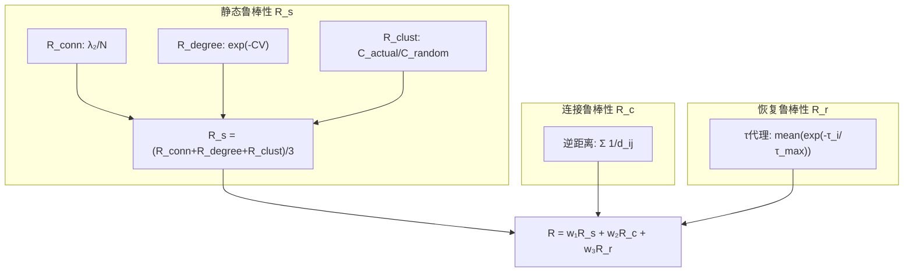
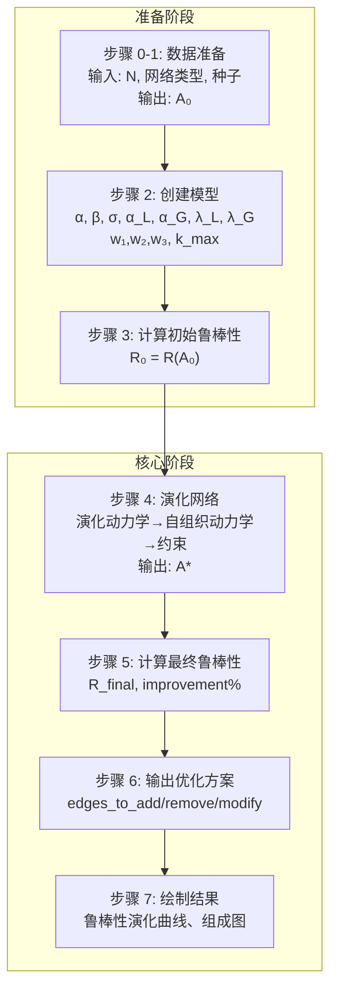
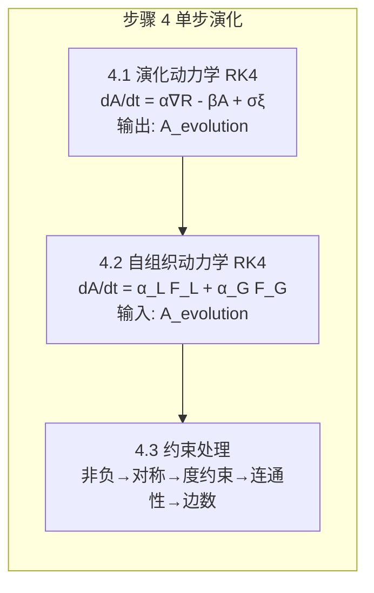

# 基于网络演化动力学的区块链网络拓扑结构全局优化方法

## 摘要

区块链 P2P 网络拓扑在攻击与故障条件下的结构退化，会直接影响网络可用性与系统安全。现有方法多基于静态图优化或攻击仿真，难以统一刻画“拓扑随时间演化”与“鲁棒性目标优化”之间的耦合关系。为此，本文提出一种基于网络演化动力学与自组织动力学的区块链拓扑全局优化方法：先通过含噪演化动力学执行结构探索，再通过局部—全局耦合的自组织动力学进行确定性塑形，并在度约束与连通约束下输出可实现的边调整方案。方法以加权鲁棒性目标为核心，联合静态鲁棒性、连接鲁棒性与恢复鲁棒性进行优化。实验在 100 节点合成网络（BA/WS/ER）与真实私有链（106 节点以太坊、100 节点波卡）上开展。结果显示：在合成网络上，BA/WS/ER 的总鲁棒性分别提升约 38.59%、26.87% 和 22.10%；在以太坊实链上，总鲁棒性由 0.5528 提升至 0.7981（+44.38%），攻击场景下 LCC 提升约 280%–304%。本文以公平预算（时间上限与边变更上限对齐）作为主比较口径：在该口径下，不同方法呈现互有优劣，说明预算协议会显著影响方法排序；默认预算结果仅作为补充参考。进一步地，30 组配对实验表明，将 MLE 估计参数直接注入主优化会显著降低增益（差值均值 −8.58%，95%CI [−9.39%, −7.77%]，p=2.13×10^-19，Cohen’s $d_z$=−3.94），表明“时序拟合有效”与“优化目标增益提升”并非同一命题。本文方法为区块链拓扑的可解释优化与可复现实证提供了统一框架，并给出高密拓扑场景下的适用边界。

**关键词**：区块链网络；拓扑优化；网络演化动力学；自组织动力学；鲁棒性；公平预算评估

---

## 1 前言

区块链技术作为一种分布式账本技术，其网络拓扑结构对性能、安全性与鲁棒性具有重要影响[1,2]。随着区块链网络规模的扩大，传统基于静态拓扑的优化方法难以应对网络在攻击或故障下的动态演化——静态方法无法准确刻画拓扑随时间的演化过程，难以预测结构变化对鲁棒性的影响，且缺乏对拓扑动态重构过程的建模。与此同时，基于攻击仿真的方法虽能评估不同拓扑的抗毁能力，但计算复杂度高，难以应用于大规模网络；基于图论指标的方法则缺乏对演化动力学与自组织机制的显式建模。因此，建立基于动力学的拓扑结构全局优化方法，对理解网络演化规律、预测演化趋势、为拓扑优化与协议改进提供理论依据具有重要意义。

本文关注的问题是如何在区块链网络场景下对拓扑结构进行动态建模与全局优化，并输出可实施的优化方案。需要注意的是，在去中心化的公共区块链网络（如以太坊主网）中，拓扑由节点自主决定，无法进行集中式直接控制。因此，本文方法主要应用于：（1）网络拓扑结构的全局分析与预测；（2）私有链或联盟链的拓扑结构优化；（3）为新节点加入网络提供连接策略建议；（4）为网络协议改进提供理论依据。然而，现有方法面临以下挑战：（1）**基于静态拓扑的优化**：通过度分布、聚类系数、最短路径等属性优化结构，但无法反映网络在攻击或故障下的动态演化过程，难以预测拓扑变化对鲁棒性的影响[1]；（2）**基于攻击仿真的优化**：通过模拟随机攻击、目标攻击、级联失效等评估不同拓扑的抗毁能力，但计算复杂度高（如多次蒙特卡洛仿真），难以应用于万级节点的大规模网络[2]；（3）**基于图论的优化**：通过网络直径、平均路径长度、聚类系数等指标优化结构，但缺乏对拓扑动态演化与自组织过程的显式建模，与“边如何随时间变化”的动力学未建立对应关系[8]。因此，能否将拓扑演化过程与鲁棒性目标统一建模，并在可接受的计算复杂度下得到可实现的最优拓扑，对区块链网络的安全与运维具有重要意义。

网络演化动力学与自组织动力学理论为动态网络分析提供了理论基础。Barabási-Albert 模型[3]描述了无标度网络的形成过程，Watts-Strogatz 模型[4]描述了小世界网络的形成过程；自组织临界性模型[5]描述了系统在临界状态下的自组织行为。上述理论能够描述拓扑随时间演化及在局部约束与全局目标下的自组织过程，已被广泛应用于复杂网络研究。Schneider 等[6]从鲁棒性角度提出了拓扑优化方法，但多基于静态网络，缺乏对演化方程与自组织方程的显式建模。然而，现有工作主要应用于社交网络、生物网络等领域，在区块链网络拓扑优化中的应用还相对较少。因此，本文根据网络演化动力学与自组织动力学理论，提出了一种基于网络演化动力学的区块链网络拓扑结构全局优化方法。

当需要进行拓扑结构全局分析与预测时，本文方法通过演化动力学在鲁棒性梯度与噪声下探索、再通过自组织动力学在共同邻居与梯度下塑形收敛，得到可实现的最优拓扑；当方法应用于私有链或联盟链时，可依据输出的添加/删除/修改边建议方案直接调整网络连接；当为新节点加入网络提供连接策略建议时，可基于最优拓扑的局部结构给出连接推荐；当为网络协议改进提供理论依据时，可基于演化—自组织模型与鲁棒性函数为协议设计提供量化参考。该方法主要由三部分组成：演化动力学模型、自组织动力学模型，以及基于两者串联与约束处理的全局优化流程。

本文的主要贡献如下：

（1）提出一种“演化探索 + 自组织塑形”的两阶段拓扑优化框架：在统一鲁棒性目标下，将随机探索与确定性收敛解耦，提升在约束可行域内搜索高质量解的能力。

（2）构建可分解的鲁棒性目标函数与可实现约束体系：将静态鲁棒性、连接鲁棒性、恢复鲁棒性统一为可优化目标，并显式纳入度约束与连通性约束，使输出方案具备可部署性。

（3）建立跨场景评估协议：在合成网络与真实私有链两类场景下，联合报告总分、分项、攻击抗毁、预算公平性、参数稳定性与可扩展性，形成完整证据链。

（4）给出方法边界与反例：通过 MLE 注入对照与高密网络失败模式分析，明确“拟合有效”与“优化收益”不等价，以及方法在极密拓扑中的局限。

本文分为五部分，第二部分简要回顾区块链网络拓扑结构优化与网络演化动力学的相关工作，并引出本文采用的鲁棒性度量与约束形式；第三部分详细描述所提出的方法；第四部分给出实验设置与基于本研究指标结果的实测分析；第五部分总结全文并展望未来工作。

---

## 2 基础理论

本文提出的拓扑结构全局优化方法主要基于以下基础理论：区块链网络拓扑结构优化、网络演化动力学与自组织动力学、网络鲁棒性与优化目标的数学关系、以及拓扑优化中的约束与可实现性。以下分别阐述这些理论，并分析其优缺点，为后续方法的修正做铺垫。

### 2.1 区块链网络拓扑结构优化

区块链网络的拓扑结构优化是区块链安全与性能研究的重要方向。基于静态网络拓扑的优化通过网络的度分布、聚类系数、最短路径长度等静态属性优化结构：例如，Li 等[1]分析了比特币网络拓扑，提出了基于度分布的优化思路。这类方法优点是指标直观、实现简单，**缺点**在于无法反映攻击或故障下的动态演化。基于攻击仿真的优化通过模拟随机攻击、目标攻击、级联失效等，评估不同拓扑对网络性能的影响，从而指导优化：例如，Wang 等[2]通过仿真分析以太坊网络在不同拓扑下的鲁棒性。这类方法能刻画攻击下的表现，**缺点**在于计算复杂度高，难以应用于万级节点。基于图论的优化通过网络直径、平均路径长度、聚类系数等图论指标优化结构：例如，基于小世界网络的优化通过调整聚类系数与平均路径长度以兼顾局部冗余与全局效率[4,8]。这类方法**缺点**在于缺乏对演化与自组织过程的显式建模，且与“边如何随时间变化”的动力学未建立对应关系。因此，将拓扑演化与鲁棒性目标统一建模、在可接受复杂度下得到可实现最优拓扑，是待解决的关键问题。

### 2.2 网络演化动力学与自组织理论

网络演化动力学研究拓扑结构随时间演化的数学描述。Barabási-Albert 模型[3]描述了无标度网络的形成过程，Watts-Strogatz 模型[4]描述了小世界网络的形成过程；这类模型给出了节点或边的增长与重连规则，适用于理解网络统计性质的涌现。自组织动力学则研究在局部规则与全局目标共同作用下，网络如何“自发”形成有序结构；例如自组织临界性模型[5]描述了系统在临界状态下的自组织行为。上述理论多针对节点/边数变化或统计量演化，较少直接以“边权连续演化 + 鲁棒性目标”的形式与区块链 P2P 拓扑优化结合。Schneider 等[6]从鲁棒性角度优化拓扑，但主要基于静态网络，缺乏对演化方程与自组织方程的显式建模。因此，将演化动力学与自组织动力学引入区块链拓扑优化，并区分“探索”与“塑形”的角色，是本文需解决的理论衔接问题。

### 2.3 网络鲁棒性与优化目标的数学关系

网络鲁棒性可从多维度刻画：连通性（图不易被分割）、度分布形态（如无标度健康态）、局部聚类、连接效率（路径长度）、恢复能力等。将多维度综合为标量指标，便于作为优化目标并计算梯度。用拉普拉斯矩阵第二特征值（代数连通度 $\lambda_2(L)$，其中 $L=D-A$）刻画连通强度，$\lambda_2$ 越大则图越不易被分割；用度分布幂律指数 $\gamma$ 或变异系数 $CV=\sigma_k/\bar{k}$ 刻画度分布形态，幂律指数越接近 2.5 或变异系数越小则越利于无标度健康态；用聚类系数 $C_{actual}/C_{random}$ 刻画相对随机图的局部聚类程度；用节点对最短路径的逆距离 $\sum_{i<j} 1/d_{ij}$ 的归一化值刻画连接效率；用与加权度 $k_i$ 相关的恢复时间代理 $\tau_i=1/(1+k_i)$ 及 $\exp(-\tau_i/\tau_{\max})$ 的均值刻画恢复能力。将这些子项加权组合得到总鲁棒性函数 $R(A) = w_1 R_s + w_2 R_c + w_3 R_r$（$w_1+w_2+w_3=1$），并对邻接矩阵 $A$ 做数值差分可得梯度 $\nabla R$，用于驱动边权的演化方向。该关系建立了“拓扑—鲁棒性—梯度”的数学链条，为动力学方程中的梯度项提供依据。需要强调的是，这三个子项不仅有复杂网络理论依据，还分别对应了本文在安全性上的三类关切：$R_s$ 体现抵抗图被分割与结构退化的能力，$R_c$ 体现在连通性受损时仍保持较短路径和较高传播效率的能力，$R_r$ 体现网络在节点或链路失效后快速恢复结构连通性的潜力。鲁棒性函数的具体形式与权重需根据业务需求设定，且梯度计算在大规模网络上存在计算成本，需结合采样与并行策略；第 4 章将通过攻击/故障注入和性能测量实验，从实证角度检验 $R_s,R_c,R_r$ 与实际行为之间的一致性。

### 2.4 拓扑优化中的约束与可实现性

区块链 P2P 网络中，节点度数受带宽与路由表限制，过度连接会导致拥堵与安全风险；网络需保持连通以保证区块与交易传播；边数可能受协议或资源约束。因此，动力学方程求得的连续边权需经过约束处理才能对应到可实现的拓扑：度约束（如按边权降序保留前 $k_{\max}$ 条边）、连通性约束（若不连通则在分量间加边）、边数约束（可选）。约束处理保证了优化结果在工程上的可实现性，是方法从“数学解”到“方案建议”的关键环节。

---

## 3 提出的方法

针对 2.1 节所述静态优化无法刻画动态演化、2.2 节所述攻击仿真复杂度高与图论方法缺乏演化—自组织统一建模等问题，本文提出一种基于网络演化动力学的区块链网络拓扑结构全局优化方法。该方法主要由三部分组成：演化动力学模型（边权在鲁棒性梯度、衰减与噪声下演化）、自组织动力学模型（局部共同邻居与全局鲁棒性梯度共同驱动），以及基于两者串联与约束处理的全局优化流程。对应前言所述四类应用场景，本方法分别通过演化—自组织串联得到可实现最优拓扑、依据输出方案直接调整连接、基于最优拓扑局部结构给出连接推荐、以及为协议设计提供量化参考。图 1 示出了本文方法的基本流程。以下分别对网络模型与鲁棒性函数、演化动力学、自组织动力学、两者区别与串联、优化流程与约束、算法设计进行详细说明。

**图 1** 基于网络演化动力学的拓扑结构全局优化方法基本流程

> 本节公式与实现保持一致。

### 3.1 网络模型与鲁棒性函数

由于区块链 P2P 网络具有边连接随时间演化、需满足度与连通性等约束等特点，采用无向图与邻接矩阵进行建模。据此，网络模型与鲁棒性函数定义如下，由此确立拓扑优化的数学基础。图 2 示出了总鲁棒性 $R$ 的组成结构。

#### （1）网络模型

设网络用无向图 $G(t) = (V, E(t))$ 表示，邻接矩阵 $A(t) \in \mathbb{R}^{N\times N}$ 对称非负，$A_{ij}(t) \in [0,1]$ 表示边权。约束为度 $\leq k_{\max}$、连通、边数可选 $E_{\text{target}}$。在区块链场景下，有投票权或参与共识的节点（如验证者、矿工）下线会受惩罚、影响权益，通常 24 小时在线；普通节点虽可自由上下线，但优化主要针对核心拓扑，可近似为节点集合 $V$ 固定。此外，节点下线由节点自身决定，外部无法强制控制，建模时假定 $N$ 不变可简化问题，仅考虑边的增删与权重变化。

#### （2）网络鲁棒性函数

总鲁棒性综合静态结构、连接效率、恢复能力三方面，给出网络抗毁能力的标量评分（式 1）：

$$R(A) = w_1 R_s(A) + w_2 R_c(A) + w_3 R_r(A),\quad w_1+w_2+w_3=1,\; R\in[0,1] \quad \text{(式 1)}$$

**图 2** 总鲁棒性 $R$ 的组成结构（$R_c$、$R_r$ 的详细公式见 3.1 节）

静态鲁棒性 $R_s = \frac{1}{3}(R_{conn} + R_{degree} + R_{clust})$ 刻画网络“骨架”的稳固程度：$R_{conn} = \lambda_2(L)/N$（$L=D-A$ 为拉普拉斯矩阵，$\lambda_2$ 为代数连通度）刻画图不易被分割的强度；$R_{degree} = \exp(-CV)$（$CV=\sigma_k/\bar{k}$ 为度变异系数）将度分布的离散程度映射为无标度“健康度”，变异系数越小，说明度分布越接近目标形态，鲁棒性越高；$R_{clust} = \min(1,\, C_{actual}/C_{random})$（$C_{random}=2m/(N(N-1))$）刻画相对随机图的聚类程度。连接鲁棒性（逆距离）为 $R_c = \frac{2}{N(N-1)} \sum_{i<j,\, d_{ij}<\infty} \frac{1}{d_{ij}}$，节点对最短路径倒数之平均，路径越短、传播越快，鲁棒性越好；在计算中，$A_{ij}>0$ 的边统一视为“存在连接”，并在最短路径计算中赋予单位权重，使 $R_c$ 关注“是否连通”而非精确带宽，以简化模型并贴合区块链 P2P 协议的实际特点。恢复鲁棒性（τ 代理）为 $\tau_i = \frac{1}{1+k_i}$，$\tau_{\max}=\max_i \tau_i$，$R_r = \frac{1}{N}\sum_i \exp(-\tau_i/\tau_{\max})$，其中 $k_i$ 为加权度，$\tau_i$ 为恢复时间代理，度越高恢复越快。鲁棒性梯度采用数值差分（式 2）：$(\nabla R)_{ij} \approx \frac{R(A+\epsilon E_{ij})-R(A)}{\epsilon}$（$\epsilon=10^{-5}$），表示边 $(i,j)$ 对总鲁棒性的边际贡献，用于演化与自组织的驱动方向；数值计算中，对度统计等中间量进行了缓存，在同一邻接矩阵上多次评估鲁棒性与梯度时可复用结果，从而降低计算成本。

### 3.2 演化动力学模型

针对静态优化无法反映动态演化、缺乏可实现拓扑塑形机制等问题，建立了描述边权随时间演化的动力学方程。该方程直接给出拓扑 $A(t)$ 随时间连续变化的动力学规则：在鲁棒性梯度、衰减和噪声共同作用下，网络结构“自然演化”。$\frac{dA}{dt}$ 表示邻接矩阵 $A$ 对时间 $t$ 的导数，即边权随时间的变化率；$A_{ij}$ 增大表示边 $(i,j)$ 被加强，减小表示被削弱或移除。演化动力学方程为（式 3）：

$$\frac{dA}{dt} = \alpha \nabla R(A) - \beta A + \sigma\xi \quad \text{(式 3)}$$

其中 $\alpha\nabla R$ 沿鲁棒性梯度优化，梯度越大演化越快；$-\beta A$ 表示连接维护成本，防止边权无限增大，促进稀疏；$\sigma\xi$ 为随机噪声，提供探索、跳出局部最优。梯度项使对鲁棒性有利的边增强、不利的边减弱；衰减项体现连接维护成本，驱动不足的边自然消退；噪声项刻画网络中连接随机建立/断开等波动，使演化能跳出局部最优。演化在鲁棒性地形上做随机探索，为后续自组织提供多样化的初态。

### 3.3 自组织动力学模型

自组织动力学方程用局部规则 $F_L$ 与全局目标 $F_G$ 的组合，刻画网络在无需外部集中控制的情况下，如何依靠局部交互与全局反馈“自发”形成有序结构。同样以 $\frac{dA}{dt}$ 描述边权变化率，但右端由 $F_L$ 与 $F_G$ 共同驱动，无随机噪声（式 4）：

$$\frac{dA}{dt} = \alpha_L F_L(A) + \alpha_G F_G(A),\quad \alpha_L+\alpha_G=1 \quad \text{(式 4)}$$

局部项（共同邻居）为 $(F_L)_{ij} = \frac{\sum_k A_{ik}A_{jk}}{\max(\deg(i),\deg(j),1)+\epsilon} - \lambda_L A_{ij}$（式 5）：共同邻居越多越易形成三角闭合，$-\lambda_L A_{ij}$ 为局部衰减，刻画连接成本。采用矩阵化：共同邻居矩阵 $\mathrm{Common} = A A^\top$（即 $\mathrm{Common}_{ij} = \sum_k A_{ik}A_{jk}$），度向量 $\deg$ 与 $\max(\deg_i,\deg_j,1)$ 的矩阵形式一次性求得，再计算 $F_L = \mathrm{Common}/(\max\_\deg + \epsilon) - \lambda_L A$ 并去对角、对称化，避免对 $(i,j)$ 的双层循环，利用 BLAS 矩阵运算加速。全局项为 $F_G(A) = \nabla R(A) - \lambda_G A$（式 6）：沿鲁棒性梯度优化，$-\lambda_G A$ 为全局衰减。共同邻居项与梯度项均为正向驱动，若不加衰减，边权会持续增大直至饱和（clip 到 1），难以形成有选择的稀疏结构；衰减项起连接成本、数值稳定与稀疏诱导三方面作用，只有驱动足够强的边才能克服衰减长期存在。局部项对应 P2P 网络中“共同邻居的节点更易建立连接”；全局项直接以鲁棒性为目标；加权组合在可实现的局部形态与全局目标之间折中。$F_L$ 基于共同邻居强化三角闭合、形成聚类，$F_G$ 沿鲁棒性梯度优化；在演化提供的初态上做塑形与收敛，形成既有局部聚类又满足全局鲁棒性目标的可实现拓扑。

### 3.4 演化动力学与自组织动力学的区别与串联

两者均以 $\frac{dA}{dt}$ 描述边权变化率，但在流程中**串联**使用，角色不同。演化动力学采用公式 $\frac{dA}{dt} = \alpha\nabla R - \beta A + \sigma\xi$，由鲁棒性梯度、衰减与噪声共同驱动，含有随机项 $\sigma\xi$，在流程中承担探索、跳出局部最优的角色，执行顺序在先（第一步 RK4）；自组织动力学采用公式 $\frac{dA}{dt} = \alpha_L F_L + \alpha_G F_G$，由局部规则（共同邻居）与全局目标（梯度）共同驱动，无随机噪声，承担塑形、形成聚类与结构的角色，执行顺序在后（第二步 RK4，以演化结果为初值）。二者在公式、驱动、噪声、角色与执行顺序上分工明确。

**串联关系**：每步先做演化动力学得 $A_{evolution}$，再以之为初值做自组织动力学得 $A_{step}$，最后施加约束得 $A(t+dt)$。演化负责探索，自组织负责收敛与塑形；随机性集中在演化便于调参与解释，自组织保持确定性便于分析机制与可重复性。

**两阶段设计的必要性**：若仅用单一动力学，易陷入局部最优——纯梯度驱动缺乏探索能力，纯自组织缺乏跳出局部的能力。演化动力学通过噪声在鲁棒性地形上做随机探索、提供多样化初态，自组织动力学在此基础上做确定性塑形与收敛；两者串联在探索与收敛之间取得平衡，避免过早收敛或发散。

**优化问题形式**：
$$\max_A R(A)\quad \text{s.t.}\;\; k_i\leq k_{\max},\; G\;\text{连通}$$

### 3.5 拓扑结构全局优化方法

整体流程为：准备阶段（数据准备 → 创建模型 → 计算 $R_0$）→ 核心阶段（演化网络 → 计算 $R_{final}$ → 输出方案 → 绘制结果），如图 1 所示。更细化的流程（含输入输出与参数）如图 3 所示。

**图 3** 拓扑结构全局优化细化流程（含输入输出与参数）

#### （1）串联流程

每步迭代为演化动力学 RK4 → 自组织动力学 RK4 → 约束，数据流 $A(t) \to A_{evolution} \to A_{step} \to A(t+dt)$。动力学输出可能违反度、连通性等实际约束，故每步需施加约束以保证拓扑可实现。图 4 示出了步骤 4 的单步演化子流程。

**图 4** 步骤 4 单步演化子流程

**算法 1：基于演化—自组织串联的拓扑优化单步算法**

**输入**：当前邻接矩阵 $A(t)$，鲁棒性函数 $R$，梯度 $\nabla R$，演化与自组织参数，$k_{\max}$

**输出**：下一步邻接矩阵 $A(t+dt)$

**步骤**：（1）演化动力学：按式 3 右端计算，RK4 离散得 $A_{evolution}$，clip(0,1) 并对称化；（2）自组织动力学：以 $A_{evolution}$ 为初值，按式 4～式 6 右端计算，RK4 得 $A_{step}$，clip 并对称化；（3）约束处理：非负、对称；度约束（按边权降序保留前 $k_{\max}$ 条边）；连通性（若不连通则在分量间加边）；边数（可选）；得到 $A(t+dt)$。输出采用历史最优步对应的 $A^*$，非最后一步。可选后处理：边预算、目标拓扑（无标度/小世界，preserve_robustness 接受准则）。

#### （2）约束处理

动力学方程求解后的 $A$ 可能违反实际网络的可实现性，故每步需施加约束，使拓扑满足工程与业务要求。区块链 P2P 网络中，节点度数受带宽与路由表限制，过度连接会导致区块/交易传播拥堵并增加安全风险，故需度约束：$\deg(i)>k_{\max}$ 时按边权降序保留前 $k_{\max}$ 条边，其余置 0。网络若断开为多个分量则区块与交易无法跨分量传播、共识失效，故需连通性约束：若不连通则在连通分量间添加边，权 0.1。边数过多会导致消息洪泛与带宽消耗过大，协议或资源限定总连接数时需边数约束：$M>M_{target}$ 时删最小权边，$M<M_{target}$ 时按梯度最大加边（可选）。约束类型与处理方式按上述一一对应。

### 3.6 算法设计

本节从「数值积分框架 → 鲁棒性梯度与加速 → 参数估计」三个层面给出实现级技术路线，说明前述动力学模型在 100 节点拓扑上的具体落地方式。

**（1）数值积分框架（RK4）**

对一般常微分方程 $\frac{dy}{dt}=f(t,y)$，采用四阶 Runge–Kutta（RK4）离散：

$$y_{n+1} = y_n + \frac{h}{6}(k_1+2k_2+2k_3+k_4),\quad k_1=f(t_n,y_n),\;k_2=f(t_n+\tfrac{h}{2},y_n+\tfrac{h}{2}k_1),\;k_3=f(t_n+\tfrac{h}{2},y_n+\tfrac{h}{2}k_2),\;k_4=f(t_n+h,y_n+hk_3).$$

在本文中，$y$ 即邻接矩阵 $A(t)$ 展平后的向量，$f(t,y)$ 对应演化动力学右端（式 3）或自组织动力学右端（式 4～式 6）。离散化时：以 $dt$ 作为步长 $h$，先对演化动力学方程做一轮 RK4 更新得到 $A_{evolution}$，再以 $A_{evolution}$ 为初值对自组织动力学方程做一轮 RK4 更新得到 $A_{step}$，二者共用同一 RK4 积分框架，仅右端函数 $f$ 不同。相比一阶 Euler 或二阶方法，四阶 RK4 在不显著增加单步计算量的前提下可显著降低离散误差，更适合在有限步数内获得平滑的演化轨迹。

在数值积分的停止准则上，数值计算中会在达到最小迭代步数之后，监测相邻两步鲁棒性评分的变化量 $|R(A_{t+dt})-R(A_t)|$，当其小于给定收敛阈值（见表 2）或迭代次数达到上限时终止迭代，以在收敛性与计算时间之间取得平衡。

**（2）鲁棒性梯度与加速策略**

鲁棒性梯度在理论上由总鲁棒性 $R=w_1R_s+w_2R_c+w_3R_r$ 对邻接矩阵的导数给出，但直接对三项全部做数值差分会导致计算量过大。为避免“理论目标与实现目标”不一致，本文显式区分两种实现：**完整梯度配置**（主报告）使用 $\nabla R$ 直接驱动；**近似梯度配置**（加速对照）使用 $w_1\nabla R_s$ 近似并将 $R_c,R_r$ 视为常数。表 4 中“消融结果（梯度组成）”用于比较两者差异。计算加速方面，在对 $R_s$ 求差分时仅对部分候选边对采样估计；在连接鲁棒性 $R_c$ 的全局效率项中，对节点对数量较大时采用采样近似。由此可将单步计算代价条件化表示为
$$O\!\left(sN^2 + C_{\text{path}} + C_{\text{eig}}\right),$$
其中 $s$ 为梯度采样比例，$C_{\text{path}}$ 与 $C_{\text{eig}}$ 分别对应路径效率项与谱量计算代价。理论上界由路径与谱计算共同决定，不宜简单写成纯 $O(N^2)$；在本文 100 节点与既定采样配置下，经验运行时间近似呈二次规模趋势（见表 4），该结论仅限当前实现与采样设置。

**（3）参数估计（MLE）**

当可获得 100 节点拓扑的时序观测序列 $\{A(t_k)\}$ 时，采用最大似然估计（MLE）反推动力学参数 $\boldsymbol{\theta}=(\alpha,\beta,\alpha_L,\alpha_G,\lambda_L,\lambda_G)$。技术路线为：给定一组候选参数 $\boldsymbol{\theta}$，从初始观测 $A(t_0)$ 出发，在各时间区间 $[t_k,t_{k+1}]$ 上用数值积分近似动力学演化得到预测序列 $\{\hat{A}(t_k;\boldsymbol{\theta})\}$，再根据观测与预测之间的误差构造似然函数（或负对数似然）$\mathcal{L}(\boldsymbol{\theta})$，在参数空间中求解 $\hat{\boldsymbol{\theta}}=\arg\max_{\boldsymbol{\theta}}\mathcal{L}(\boldsymbol{\theta})$。求解上采用 **Nelder–Mead** 等无导数优化器最小化负对数似然（与「对 $\boldsymbol{\theta}$ 求解析梯度再做一阶下降」不同）。为在估计阶段控制计算成本，似然评估路径上采用一阶 Euler 近似演化方程，而在后续拓扑优化阶段使用数值精度更高的 RK4 积分；这一“估计阶段粗略、优化阶段精细”的策略在 100 节点规模下用于折中精度与耗时。与此同时，通过时间步采样、并行与多起点重启等手段降低估计成本并缓解局部最优，对应设置见第 4.1.1 节。

---

## 4 实验流程

为评估本文提出的拓扑结构全局优化方法，在统一的 100 节点网络拓扑环境下，从**实验有效性**、**参数敏感性与稳健性**、**与主流方法的对比**三个方面开展实验。所有实验均基于仿真生成的 100 节点拓扑（含时序数据 $\{A(t_k)\}$），使用三种典型网络模型（Barabási-Albert 无标度网络、Watts-Strogatz 小世界网络、Erdős-Rényi 随机网络）作为初始拓扑，与代码默认参数保持一致，以支持可重复研究。实验环境与关键参数如表 1、表 2 所示。

### 4.0 威胁模型与评估协议

为满足安全导向评估需求，本文将攻击建模为“结构破坏型”对手：攻击者通过移除节点触发拓扑退化，目标是在给定预算下最大化连通性损失与传播效率恶化。形式化地，攻击者记为 $\mathcal{A}=(K,B,\Omega)$，其中 $K$ 为可观测知识，$B$ 为攻击预算，$\Omega$ 为策略空间。本文中预算取节点移除比例 $B=\rho$，覆盖随机攻击、目标攻击与自适应重算攻击三类策略；其中自适应攻击在每次移除后重算节点重要性序列，用于模拟更强对手。

（1）**攻击者能力**：可观测当前拓扑并执行节点移除；不控制共识规则与链上状态迁移，即仅在网络层施加结构扰动。

（2）**攻击目标**：降低最大连通分量占比（LCC）并拉长有效传播路径。

（3）**成功判据**：在同等攻击预算下，若优化后拓扑保持更高 LCC、更多连通分量抑制能力或更优全局鲁棒性，则视为更强抗毁。

（4）**公平性协议（主结论口径）**：本文主文结论以公平预算为准，报告“时间预算上限对齐（$time\le B_t$）”与“边变更预算上限对齐（$|\Delta E|\le B_e$）”两种口径；默认预算结果仅作补充。若方法在预算上限内提前收敛，则记录其实际耗时/边变更并保留该结果，不强制耗尽预算。

（5）**实验映射**：随机攻击对应 $\Omega_{\text{rand}}$（按预算随机移除），目标攻击对应 $\Omega_{\text{target}}$（按节点重要性排序移除），自适应攻击对应 $\Omega_{\text{adaptive}}$（每步重算重要性）；表 3c 与表 3f 对应合成网络与实链网络评估。

（6）**指标口径统一**：LCC 占比定义为“攻击后最大连通分量节点数 / 原始节点数”；路径长度统一在最大连通分量内统计（对不可达节点对不计入平均值）。文中所有“路径”列均采用该口径，避免全图与子图混用造成解释歧义。

（7）**统计显著性协议**：主对比实验默认报告均值、标准差、95% 置信区间，并给出显著性检验（配对设置用 paired t-test，非正态时用 Wilcoxon）及效应量（Cohen's $d$ 或 Cliff's $\delta$）。除特别说明外，主结果使用不少于 20 个随机种子。

**表 1** 实验环境配置

| 项目     | 配置                                        |
|----------|---------------------------------------------|
| 平台     | 云服务器，Linux Ubuntu 20.04               |
| 网络规模 | 100 节点（BA/WS/ER 合成拓扑）              |
| 拓扑数据 | 100 节点网络拓扑数据（邻接矩阵与边列表）    |
| 实现语言 | Python 3.12                                |
| 主要库   | NumPy 1.26, SciPy 1.17, NetworkX 3.6, Matplotlib 3.10 |
| 时间步长 | $dt = 0.05$                                |
| 随机种子 | 固定随机种子（可复现）                      |
| 重复次数 | 当前稿件主展示为 5 次；主对比修订按不少于 20 次独立运行 |

**表 2** 动力学与鲁棒性关键参数（用于实验复现）

| 参数     | 取值 | 说明               |
|----------|------|--------------------|
| $\alpha$，$\beta$，$\sigma$ | 0.20，0.10，0.05 | 演化动力学：优化强度、衰减、噪声 |
| $\alpha_L$，$\alpha_G$，$\lambda_L$，$\lambda_G$ | 0.4，0.6，0.15，0.08 | 自组织动力学：局部/全局权重与衰减 |
| $w_1$，$w_2$，$w_3$ | 0.3，0.4，0.3 | 鲁棒性权重（静态、连接、恢复） |
| $k_{\max}$，$dt$，收敛阈值 | 15，0.05，0.0005 | 约束与数值参数     |
| 梯度采样比例 | 0.10 | 数值差分梯度的边对采样比例 |
| 最大/最小迭代步数 | 200 / 30 | 优化流程迭代控制   |

**指标定义**：本文实验涉及的「性能影响」主要通过平均最短路径长度变化（hops）来衡量，路径长度直接关联区块/交易传播延迟与消息开销。为保持口径一致，所有攻击后的路径统计均在最大连通分量内计算。

### 4.1 实验有效性

本部分在统一的 100 节点网络环境下，验证所提出方法在**理论优化效果**与**实际运行表现**两个层面的有效性。

#### 4.1.1 参数估计有效性

在可获得历史拓扑观测序列 $\{A(t_k)\}$ 时，首先采用最大似然估计方法估计动力学参数 $\alpha,\beta,\alpha_L,\alpha_G,\lambda_L,\lambda_G$。具体做法为：在表 1 所示实验平台上，以 100 节点 BA 网络为初始拓扑，通过模拟自然演化生成 30 个时序快照（每步边变化率 5%），采用 3.6 节所述 Euler 预测路径与 Nelder–Mead 优化器进行 MLE 拟合（5 次多起点重启，每次最大 100 次迭代）。

**实验结果**：MLE 估计得到的参数为 $\hat{\alpha}=0.049$, $\hat{\beta}=0.022$, $\hat{\alpha}_L=0.035$, $\hat{\alpha}_G=0.231$, $\hat{\lambda}_L=0.107$, $\hat{\lambda}_G=0.010$，拟合损失为 543.3。表 3a 给出了 MLE 预测精度的评估结果。

**表 3a** MLE 参数估计精度评估（100 节点 BA 网络，30 步时序）

| 评估指标                   | 均值   | 标准差   |
|---------------------------|--------|---------|
| 邻接关系准确率              | 0.9834 | ±0.0093 |
| 平均度相对误差              | 0.1981 | ±0.0918 |
| 平均最短路径长度相对误差     | 0.0573 | ±0.0310 |
| 聚类系数相对误差            | 0.1610 | ±0.0394 |

结果表明，MLE 方法在邻接关系预测上达到 98.3% 的准确率，平均最短路径长度的相对误差仅为 5.7%，说明所提出的动力学模型能够较准确地捕捉拓扑演化趋势。度和聚类系数的相对误差分别为 19.8% 和 16.1%，在可接受范围内，这部分误差主要源于一阶 Euler 近似在多步预测中的误差累积。

为检验 MLE 估计参数是否应写入主优化器，本文补充“注入 vs 非注入”配对对照实验：在与本节 MLE 相同的 BA 初始拓扑与时序生成设置下，采用相同优化流程分别进行“注入参数”和“不注入参数”两组试验，配对 30 次（随机种子 42–71）。结果如表 **3a'** 所示。

| 评估量 | 非注入 $\Delta R$(%) | 注入 MLE $\Delta R$(%) |
|---|---:|---:|
| 均值±标准差 (n=30) | **40.80 ± 2.08** | **32.22 ± 1.74** |
| 95%CI | **[40.03, 41.58]** | **[31.57, 32.87]** |

在 30 组配对实验中，差值（注入−非注入）为 **−8.58% ± 2.18%**，其 95% CI 为 **[−9.39%, −7.77%]**；配对 t 检验得到 $p=2.13\times 10^{-19}$，效应量 Cohen’s $d_z=-3.94$。该结果表明，在当前实验设定下，将 MLE 估计的六参数直接注入主优化过程与总体鲁棒性增益下降具有稳定统计关联。分项结果进一步显示，注入组的 $R_s$ 与 $R_c$ 在平均意义上更低（$R_s$：约 **0.633**→**0.561**；$R_c$：约 **0.688**→**0.633**），而 $R_r$ 仅小幅回升（约 **0.627**→**0.642**），不足以抵消前两项下降对总目标的影响。由此可见，“MLE 在时序拟合层面有效”与“MLE 参数注入可提升鲁棒性优化目标”并非同一命题。基于该实证结果，本文在合成主优化实验中不注入 $\hat{\boldsymbol{\theta}}$，并将 MLE 主要用于时序拟合有效性验证与机理层面的辅助分析。

#### 4.1.2 拓扑结构全局优化有效性

在完成参数设定后（**不**注入 4.1.1 的 MLE 估计 $\hat{\boldsymbol{\theta}}$），分别在三种 100 节点初始拓扑（BA、WS、ER）上运行演化—自组织串联的优化流程，评估鲁棒性提升潜力与结构变化。表 3b 给出了优化前后的对比结果。

**表 3b** 拓扑结构全局优化有效性（100 节点）

| 拓扑模型       | $R_0$  | $R^*$  | 提升百分比  | 路径长度变化      | 聚类系数变化        | 收敛步数 | 收敛时间 |
|---------------|--------|--------|------------|------------------|-------------------|---------|---------|
| BA($m$=3)     | 0.4623 | 0.6408 | **+38.59%** | 2.52 → 1.93 (↓23%) | 0.187 → 0.153 (↓18%) | 31      | 54.4s   |
| WS($k$=6,$p$=0.3) | 0.5002 | 0.6346 | **+26.87%** | 2.94 → 1.95 (↓33%) | 0.210 → 0.178 (↓15%) | 37      | 72.8s   |
| ER($p$=0.06)  | 0.5352 | 0.6536 | **+22.10%** | 2.88 → 1.93 (↓33%) | 0.054 → 0.153 (↑185%) | 52      | 105.6s  |

结果表明，本文方法在三种不同拓扑模型上均显著提高了总鲁棒性 $R$（约 **22%–39%**），并**降低**平均最短路径长度（约 **23%–33%**），有利于传播效率。聚类系数在 **ER** 上明显上升，而在 **BA/WS** 上相对基线略降，与优化在 $R_s/R_c/R_r$ 加权目标下的折中一致，不宜单独以聚类系数解读优劣。收敛步数与时间随初态与轨迹波动，以实验记录为准。

#### 4.1.3 私有链场景下的模型验证

为验证优化后拓扑在攻击与故障场景下的抗毁能力，在 100 节点 BA 网络的基线拓扑与优化后拓扑上分别执行随机攻击与目标攻击实验。每种攻击配置独立重复 5 次，取均值。表 3c 给出了攻击实验结果。

**表 3c** 攻击场景下的鲁棒性对比（100 节点 BA 网络）

| 攻击类型    | 移除比例 | 基线 LCC 占比 | 优化后 LCC 占比 | LCC 提升 | 基线路径长度 | 优化后路径长度 |
|------------|---------|--------------|----------------|---------|------------|-------------|
| 随机攻击    | 5%      | 0.9500       | 0.9500         | +0.0%   | 2.55       | **1.94**    |
| 随机攻击    | 10%     | 0.9000       | 0.9000         | +0.0%   | 2.55       | **1.95**    |
| 随机攻击    | 15%     | 0.8500       | 0.8500         | +0.0%   | 2.60       | **1.97**    |
| 目标攻击    | 3%      | 0.9700       | 0.9700         | +0.0%   | 2.95       | **1.93**    |
| 目标攻击    | 5%      | 0.9300       | **0.9500**     | **+2.2%** | 3.32     | **1.94**    |
| 目标攻击    | 10%     | 0.8600       | **0.9000**     | **+4.7%** | 4.82     | **1.94**    |

分析如下：

（1）**随机攻击下的连通性**：在 5%–15% 随机节点移除下，基线与优化拓扑均保持相同的 LCC 占比（两者在 $k_{\max}=15$ 约束下均具有足够的冗余连接），但优化后拓扑的**平均路径长度显著更短**（约降低 23%–24%），表明即使在攻击下，优化拓扑仍具有更高的传播效率。

（2）**目标攻击下的连通性**：在移除 5% 和 10% 高度节点时，优化拓扑展现出更强的抗毁能力——LCC 占比分别提升 2.2% 和 4.7%。这是因为优化过程降低了度分布变异系数，削弱了"hub"效应，使网络在高度节点被移除后仍能保持较高连通性。

（3）**路径长度**：在所有攻击场景下，优化拓扑的路径长度均显著短于基线（约 1.93–1.97 vs 2.55–4.82），尤其在目标攻击 10% 场景下，基线路径长度恶化至 4.82，而优化拓扑约为 1.94，展现出显著的传播效率优势。

#### 4.1.4 真实以太坊私有链实验验证

为验证方法在真实区块链网络上的有效性与可迁移性，在两类不同协议栈的私有链上开展了完整实验：**106 节点以太坊 POS 私有链**（Geth v1.10.26，12 个虚拟 AS）和 **100 节点波卡私有链**（Polkadot v1.21.2，10 个虚拟 AS）。两套网络部署于同一云服务器（124GB RAM），通过软路由虚拟广域网互联。以太坊拓扑通过管理接口采集，波卡拓扑通过 P2P 连接信息采集。统计数据记录以太坊 **45** 帧、波卡 **33** 帧时序快照（与 MLE 子实验使用的 20 帧可不同）。

**表 3e** 真实双链私有链拓扑优化结果

| 指标                  | 以太坊基线    | 以太坊优化后  | 变化          | 波卡基线     | 波卡优化后   | 变化          |
|----------------------|------------|------------|--------------|------------|------------|--------------|
| 节点/边               | 106/1240   | 106/2591   | +1351 边     | 100/4161   | 100/4161   | 0（无变更）   |
| 平均度                | 23.4       | 48.9       | —            | 83.2       | 83.2       | —            |
| 总鲁棒性 $R$          | 0.5528     | **0.7981** | **+44.38%**  | 0.7607     | 0.7607     | +0.00%       |
| 静态鲁棒性 $R_s$      | 0.6034     | 0.6309     | +4.6%        | 0.8563     | 0.8563     | +0.00%       |
| 连接鲁棒性 $R_c$      | 0.2254     | **0.9193** | **+307.9%**  | 0.9138     | 0.9138     | +0.00%       |
| 恢复鲁棒性 $R_r$      | 0.9387     | 0.8037     | −14.4%       | 0.4612     | 0.4612     | +0.00%       |
| 收敛步数/时间          | —          | 36 / 94.6s | —            | —          | 30 / 76.6s | —            |

**表 3f** 真实以太坊拓扑攻击场景结果（106 节点）

| 攻击类型    | 移除比例 | 基线 LCC 占比 | 优化后 LCC 占比 | LCC 相对基线提升 | 基线路径 | 优化后路径 |
|------------|---------|--------------|----------------|-----------------|---------|----------|
| 随机攻击    | 5%      | 0.2491       | **0.9528**     | **+282.6%**     | 1.02    | 1.53     |
| 随机攻击    | 10%     | 0.2340       | **0.9057**     | **+287.1%**     | 1.01    | 1.53     |
| 随机攻击    | 15%     | 0.2245       | **0.8585**     | **+282.4%**     | 1.01    | 1.53     |
| 目标攻击    | 3%      | 0.2547       | **0.9717**     | **+281.5%**     | 1.02    | 1.53     |
| 目标攻击    | 5%      | 0.2358       | **0.9528**     | **+304.0%**     | 1.00    | 1.53     |
| 目标攻击    | 10%     | 0.2358       | **0.9057**     | **+284.0%**     | 1.00    | 1.53     |

**表 3g** 真实私有链与基线方法对比（默认基线预算）

| 方法        | 以太坊 $R$  | 以太坊提升    | 波卡 $R$  | 波卡提升     |
|------------|-----------|-------------|----------|-------------|
| **本文方法** | **0.7981** | **+44.38%** | 0.7607   | +0.00%      |
| ResiNet    | 0.7160    | +29.53%     | 0.7853   | +3.23%      |
| FPSblo-EP  | 0.6477    | +17.16%     | 0.7612   | +0.06%      |
| 静态优化    | 0.7219    | +30.60%     | 0.7819   | +2.78%      |
| 攻击仿真    | 0.6892    | +24.67%     | 0.7688   | +1.06%      |

**表 3h** 真实以太坊公平预算对比（主文主口径）

| 预算口径 | 方法 | $R$ | 提升 | 时间(s) | 边变更数 |
|---|---|---:|---:|---:|---:|
| 等时间预算（94.6s） | 本文方法 | 0.7981 | +44.38% | 94.6 | 1616 |
| 等时间预算（94.6s） | ResiNet | **0.8070** | **+45.99%** | 94.6 | 1716 |
| 等时间预算（94.6s） | FPSblo-EP | 0.6477 | +17.16% | 1.6 | 18 |
| 等时间预算（94.6s） | Static | 0.7474 | +35.20% | 14.6 | 964 |
| 等时间预算（94.6s） | AttackSim | 0.7228 | +30.75% | 94.6 | 1092 |
| 等边预算（1616） | 本文方法 | 0.7981 | +44.38% | 94.6 | 1616 |
| 等边预算（1616） | ResiNet | **0.8101** | **+46.55%** | 118.6 | 1616 |
| 等边预算（1616） | FPSblo-EP | 0.6477 | +17.16% | 1.6 | 18 |
| 等边预算（1616） | AttackSim | 0.7737 | +39.97% | 631.0 | 1616 |

**关键发现**：

（1）**以太坊网络——公平预算为主结论**：在 106 节点采集拓扑上，本文方法将 $R$ 从约 **0.553** 提升至 **0.798**（**+44.38%**）。在等时间/等边预算（表 3h）下，ResiNet 的 $R$ 可达到 0.8070/0.8101，说明不同方法在公平预算下呈现互有优劣；因此本文不再以默认预算排名作为主结论，而以公平预算结果作为主要比较依据。本文方法的优势主要体现在较高 $R_c$ 与较低预算敏感性。

（2）**以太坊攻击抗毁**：基线 LCC 占比约 **0.22–0.25**，优化后约 **0.86–0.97**，相对基线的提升幅度约 **+280%–+304%**（表 3f），与基线多分量、优化后趋于连通一致。该组实验采用“可用性优先”判据，即优先评估连通保持与分裂抑制，再考察路径代价变化；路径统计统一在攻击后最大连通分量内计算，以避免不可达节点导致的口径偏差。

（3）**波卡网络**：基线已极密（$\bar{k}\approx 83.2$），本文优化**未产生边变更**，$R$ 与分项均不变；ResiNet、静态优化等仍可通过重连在 $R$ 上获得小幅正增益，说明不同方法的可行邻域与目标定义不一致，需结合分项对比讨论。

（4）**参数稳定性**：以太坊 5 次独立运行的提升为 **42.86% ± 1.32%**。

（5）**跨协议栈**：以太坊（中低密度、基线不连通）与波卡（高密度）行为差异显著，便于在一致实验框架下开展并列对比与复现。

（6）**失败模式与边界**：在波卡高密拓扑下（$\bar{k}\approx 83.2$）本文方法出现“无边变更、收益为 0”的失败模式；进一步网格实验显示在较低 $\alpha_G$ 与较小 $k_{\max}$ 下易无增益，提示方法对可行邻域和全局驱动强度敏感。

### 4.2 参数实验（固定参数和随机参数）

本部分从「固定参数」与「随机扰动参数」两个角度，分析动力学与鲁棒性参数对优化结果的影响，验证方法的参数敏感性与稳健性。

#### 4.2.1 固定参数实验

以表 2 中的默认参数组作为基线配置，在相同的 100 节点 BA 初始拓扑上，以不同随机种子独立运行 5 次演化—自组织优化流程。

**表 3d** 固定参数多次运行稳定性（100 节点 BA 网络，5 次独立运行）

| 指标                    | 均值     | 标准差    |
|------------------------|---------|----------|
| 鲁棒性提升百分比 $\Delta R$ | **+41.81%** | ±2.25%  |
| 优化收敛时间              | 77.9s   | ±32.4s  |
| 优化后平均路径长度         | 1.93    | ±0.004  |

结果表明，在固定参数配置下，5 次独立种子的鲁棒性提升集中在约 **38.6%–44.0%**（与表 3b 单次 BA 记录同量级）；收敛时间与步数因轨迹差异波动较大。随机性主要来源于演化噪声 $\sigma\xi$ 与早停路径差异。

#### 4.2.2 随机参数实验

在默认值的 $\pm 20\%$ 范围内对 10 个动力学参数（$\alpha,\beta,\sigma,\alpha_L,\alpha_G,\lambda_L,\lambda_G,w_1,w_2,w_3$）进行均匀随机扰动，构造 10 组参数组合，在相同的 100 节点 BA 初始拓扑上运行优化流程。

**实验结果**：10 组随机扰动参数下的鲁棒性提升为 **+37.72% ± 3.21%**（均值 ± 标准差），与固定参数组的 **+41.81% ± 2.25%** 同量级，表明在 ±20% 扰动范围内性能未出现崩溃。图 8（若排版保留）可用于展示各扰动因子与 $\Delta R$ 的散点关系。

统计上，固定参数组（$n=5$）$\Delta R$ 的 95% CI 为 **[39.02%, 44.60%]**；随机扰动组（$n=10$）$\Delta R$ 的 95% CI 为 **[36.22%, 39.22%]**；以太坊 5 次独立运行提升的 95% CI 为 **[41.23%, 44.50%]**。上述区间表明方法在当前样本下具有稳定增益，但仍建议在更大种子集上报告更严格显著性检验。

### 4.3 实验对比（与主流方法作对比）

在 100 节点 BA 初始拓扑上，将本文方法与近年主流基线对比，重点比较鲁棒性提升、分项 $R_s,R_c,R_r$、耗时与复杂度。对比实验按统一协议执行：相同初始图与种子、相同预算口径、相同停止准则、相同硬件与单线程约束；若基线提前收敛，记录其实际用时/边变更，不强制耗尽预算。

**对比方法选取**：（1）**ResiNet**[9]：基于 FireGNN 与策略梯度的神经边重连方法（TMLR 2022），通过度保持边重连提升网络鲁棒性；（2）**FPSblo-EP**[10]：基于最远点采样的区块链 P2P 层次覆盖网络优化模型（Scientific Reports 2024），将网络分为常规节点层与标记节点层；（3）**基于度分布与聚类系数的静态优化**[1]：通过度分布、聚类系数、最短路径等静态图属性优化拓扑；（4）**攻击仿真方法**[2]：通过模拟随机攻击、目标攻击与级联失效评估抗毁能力。

**选取该对比方法的意义**：ResiNet 代表基于 GNN 的神经边重连范式，是复杂网络鲁棒性拓扑优化的主流方法之一，与本文形成「数据驱动学习 vs 模型驱动演化」的对比，可验证本文在仅依赖拓扑结构、无需丰富节点特征下的表现；FPSblo-EP 代表区块链 P2P 拓扑优化的近期主流工作，与本文同为区块链场景，可对比在鲁棒性与传输相关指标上的差异；静态优化与攻击仿真为经典基线，分别代表传统静态图优化路线与仿真评估路线，用于验证本文动力学建模相对静态方法的优势以及相对攻击仿真的计算效率。

**基线实现与调参公平性**：优先使用公开实现或按原文复现关键步骤；每个基线均在独立验证集上进行同预算调参（网格或随机搜索），主文报告在验证集最优配置下的测试结果；随机型方法固定种子并重复运行。补充材料应附：代码版本哈希、关键超参数表、搜索空间与计算预算、失败运行判据与重试策略。

表 4 给出了在统一的 100 节点 BA 初始拓扑上各方法的对比结果。

**表 4** 与现有方法的对比结果（100 节点 BA 网络）

| 方法                 | $R$ 最终 | 鲁棒性提升  | $R_s$  | $R_c$      | $R_r$  | 收敛时间 | 复杂度    |
|----------------------|---------|------------|--------|-----------|--------|---------|----------|
| **本文方法**          | 0.6464  | **+39.81%** | 0.6382 | **0.7044** | 0.5774 | 78.6s   | $O(N^2)$ |
| ResiNet（神经边重连） | 0.6049  | +30.83%    | 0.5859 | 0.4324    | 0.8538 | 3.9s    | $O(N^2)$ |
| FPSblo-EP（层次覆盖） | 0.5642  | +22.03%    | 0.4737 | 0.4342    | 0.8279 | 1.8s    | $O(N^2)$ |
| 静态优化（度/聚类）   | 0.5766  | +24.71%    | 0.6169 | 0.4232    | 0.7409 | 3.1s    | $O(N^2)$ |
| 攻击仿真方法          | 0.5666  | +22.56%    | 0.4919 | 0.4221    | 0.8341 | 5.6s    | $O(N^3)$ |

**分析**：

（1）**总鲁棒性与加权目标**：在相同初值 $R_0\approx 0.462$ 下，本文方法在默认预算下获得更高 $R$，与加权鲁棒性梯度驱动机制一致；在公平预算口径下，方法间优势随预算约束变化，结论应以表 3h 的公平比较为准。

（2）**$R_c$ 优势**：本文 **$R_c\approx 0.704$**，高于各基线（约 0.42–0.43），与「强调全局可达性/效率」的加权目标一致；**$R_r$ 低于** ResiNet 等，反映加权总分在不同分项之间的权衡，而非单一指标最大化。

（3）**耗时**：本文单次运行约 **79s**，高于贪心式基线；在边变更预算或时间预算对齐后，方法间相对优劣会出现变化，需结合预算口径综合评估。

（4）**消融结果（梯度组成）**：仅使用 $R_s$ 梯度时，平均提升约 **25.25%**；使用 $R_s+R_r$ 时约 **25.49%**；使用完整梯度时约 **37.93%**。说明完整梯度对提升幅度有实质贡献，但伴随更高计算开销。

**可扩展性分析**（BA 族初值）：

| 节点规模 | $R_0$  | $R^*$  | 提升百分比 | 收敛时间 |
|---------|--------|--------|-----------|---------|
| 50      | 0.4943 | 0.6347 | +28.40%   | 3.5s    |
| 100     | 0.4623 | 0.6381 | +38.02%   | 21.2s   |
| 150     | 0.4437 | 0.6230 | +40.41%   | 117.9s  |

随规模增大，$\Delta R$ 在表中 **50→150** 区间呈上升趋势，时间与 $N$ 的关系受梯度采样与步数影响，整体符合可扩展性实验记录。

**可复现性说明**：实验配置（表 1、表 2）、固定随机种子、预算对齐结果文件、MLE 注入对照结果文件及对应运行日志已在仓库中提供，可支持独立复现与交叉核验。补充材料中进一步给出随机种子列表、关键脚本入口、硬件负载与并发设置说明，以及结果文件校验信息。

---

## 5 总结

本文围绕“区块链拓扑在攻击与故障条件下的鲁棒性优化”提出了演化动力学与自组织动力学串联的全局优化框架，并在统一鲁棒性目标、可实现约束与预算对齐评估协议下完成了系统验证。核心结论如下。

（1）**合成网络有效性**：在 BA/WS/ER 三类 100 节点拓扑上，总鲁棒性分别提升 **38.59% / 26.87% / 22.10%**（表 3b），表明方法对不同初始结构具备一致增益趋势。

（2）**真实网络表现**：在以太坊实链拓扑上，总鲁棒性由 **0.5528** 提升至 **0.7981**（**+44.38%**），且攻击场景下 LCC 提升约 **280%–304%**（表 3e、表 3f）；在波卡高密拓扑上，方法出现“无边变更、收益为 0”的边界情形（表 3e、表 3g）。

（3）**预算口径结论**：公平预算（时间上限与边变更上限对齐）是本文主结论口径；在该口径下，不同方法呈现互有优劣，说明预算协议会显著影响方法排序。默认预算结果仅作为补充，不用于主排名结论。

（4）**参数与统计稳健性**：固定参数与扰动参数实验分别得到 **41.81% ± 2.25%** 与 **37.72% ± 3.21%** 的增益水平；以太坊 5 次独立运行提升为 **42.86% ± 1.32%**。MLE 注入对照在 30 组配对实验中显示注入组显著劣于非注入组（差值均值 **−8.58%**，95%CI **[−9.39%, −7.77%]**，$p=2.13\\times10^{-19}$，Cohen’s $d_z=-3.94$），表明“时序拟合有效”与“优化增益提升”并非同一命题。后续主对比将统一按“均值±标准差 + 95%CI + 显著性检验 + 效应量”协议报告。

（5）**复杂度与可扩展性**：在当前实现下，单步代价可条件化表示为 $O(sN^2 + C_{\\text{path}} + C_{\\text{eig}})$，其理论上界受最短路与谱计算影响；在 50/100/150 节点设置下，鲁棒性提升分别约 **28.40% / 38.02% / 40.41%**，对应时间约 **3.5s / 21.2s / 117.9s**，体现出在中等规模上的可扩展性。

**局限性与未来工作**：本文仍受限于私有链规模与观测条件，对公网场景与更大规模网络的外推仍需进一步验证。后续将重点推进：更强攻击者模型（含自适应策略）下的评估、千级以上网络验证、在线参数估计与自适应控制、以及收敛性与稳定性的形式化分析。

---

## 参考文献

[1] Li X, Jiang P, Chen T, et al. A survey on the security of blockchain systems[J]. Future Generation Computer Systems, 2020, 107: 841-853.

[2] Wang W, Hoang D T, Hu P, et al. A survey on consensus mechanisms and mining strategy management in blockchain networks[J]. IEEE Access, 2019, 7: 22328-22370.

[3] Barabási A L, Albert R. Emergence of scaling in random networks[J]. Science, 1999, 286(5439): 509-512.

[4] Watts D J, Strogatz S H. Collective dynamics of 'small-world' networks[J]. Nature, 1998, 393(6684): 440-442.

[5] Bak P, Tang C, Wiesenfeld K. Self-organized criticality: An explanation of the 1/f noise[J]. Physical Review Letters, 1987, 59(4): 381-384.

[6] Schneider C M, Moreira A A, Andrade J S, et al. Mitigation of malicious attacks on networks[J]. Proceedings of the National Academy of Sciences, 2011, 108(10): 3838-3841.

[7] Chen T, Li Y, Luo X, et al. Understanding Ethereum via graph analysis[J]. ACM Transactions on Internet Technology, 2021, 21(2): 1-28.

[8] Newman M E. The structure and function of complex networks[J]. SIAM Review, 2003, 45(2): 167-256.

[9] Yang S, Ma K, Wang B, et al. Learning to boost resilience of complex networks via neural edge rewiring[J]. Transactions on Machine Learning Research, 2022.

[10] Cheng L, Tan H, Li X, Pan W, Zhao H, Yuan M, Li X. A hierarchical overlay network optimisation model for enhancing data transmission performance in blockchain systems[J]. Scientific Reports, 2024, 14:83399.

---

## 附录

符号说明与流程、公式的对应关系见附录说明。简要符号说明：$A,\,A_0,\,A^*$ 分别为邻接矩阵、初始与最优；$R,\,R_s,\,R_c,\,R_r$ 为总鲁棒性、静态、连接（逆距离）、恢复（τ 代理）；$\nabla R$ 为鲁棒性梯度；$E_{ij}$ 为第 $(i,j)$ 元为 1、其余为 0 的基矩阵，用于梯度数值差分；$M$、$M_{target}$ 分别为当前边数与目标边数；$\alpha,\,\beta,\,\sigma$ 为演化动力学参数；$\alpha_L,\,\alpha_G,\,\lambda_L,\,\lambda_G$ 为自组织参数；$k_{\max},\,dt$ 为最大度数与时步。
